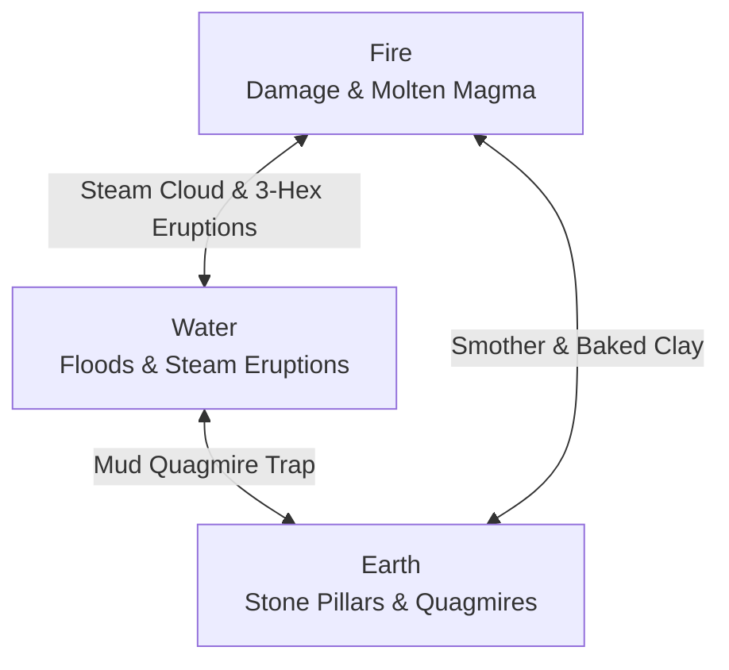

# 02. Elemental Reaction Matrix (Core Triad)

The battlefield in **Elemental Hex Tactics 3D** is living matter. Every hex tile has an **Elemental State** and a **Tier Level**, calcualted on the fly by [`TerrainReactionSystem.cs`](https://github.com/NealversePrime/ElementalHexTactics3D/blob/main/Assets/Scripts/Combat/TerrainReactionSystem.cs).

---

## The Core Triad: Fire, Water, Earth

> **Design Note (Why no Air/Wind element?):**  
> Kept getting asked if I'm gonna add Wind or Lightning. Short answer: no, at least not for the core grid. Three elements is the sweet spot for rock-paper-scissors chemistry. Fire + Water = Steam already handles the "vapor/air" fantasy without needing a 4th spell button that clutters the action bar. Keep it tight.

---

## 2D Cross-Reference Matrix

The fastest way to look up any interaction: find the **Target Ground** row on the left, then look under the **Spell Cast** column.

| Target Ground State | 🔥 Fireball (Fire) | 💧 Water Surge (Water) | ⛰️ Earth Spire (Earth) |
| :--- | :--- | :--- | :--- |
| **Barren / Grass (T0)** | **Scorched Earth (T1)** | **Shallow Water (T1)** | **Stone Pillar (T2 Wall)** |
| **Scorched Earth (T1)** | **Molten Magma (T2)** *(3 Dmg Hazard)* | **Steam Cloud (T1)** *(Local Vapor)* | **Barren (T0)** *(Embers Smothered)* |
| **Molten Magma (T2)** | *(Refreshes Magma)* | **Scorched (T1) + 💥 3 Steam Eruptions!** | **Barren (T0)** *(Lava Smothered)* |
| **Shallow Water (T1)** | **Steam Cloud (T1)** *(Vapor Cover)* | **Deep Water (T2)** *(Mobility Trap)* | **Mud Quagmire (T1)** *(Immobilize Trap)* |
| **Deep Water (T2)** | **Steam Cloud (T1)** *(Vapor Cover)* | *(Refreshes Deep Water)* | **Mud Quagmire (T1)** *(Immobilize Trap)* |
| **Mud Quagmire (T1)** | **Baked Mud (Scorched T1)** | **Flooded Mud (Water T1)** | **Barren (T0)** *(Quagmire Compacted)* |
| **Steam Cloud (T1)** | **Scorched Earth (T1)** | **Shallow Water (T1)** | **Stone Pillar (T2 Wall)** |

---

## Reactions Grouped by Spell Cast

Quick cheat sheet for what each spell in your action bar does when targeted:

### 💧 Water Surge (`Water`)
| Cast On... | Resulting State | Tier | Reaction Name | Tactical Effect |
| :--- | :--- | :---: | :--- | :--- |
| **Molten Magma (T2)** | **Scorched Earth** | 1 | **Steam Cataclysm** | Cools lava to Scorched Earth; **violently erupts Steam on 3 random adjacent hexes**! |
| **Scorched Earth (T1)** | **Steam Cloud** | 1 | **Steam Eruption** | Quenches burning embers into neutral ground and creates a local Steam Cloud. |
| **Shallow Water (T1)** | **Deep Water** | 2 | **Deep Water Surge** | Deepens water into treacherous **Deep Water (Immobilize & Cripple Trap)**. |
| **Mud Quagmire (T1)** | **Shallow Water** | 1 | **Flooded Mud** | Dilutes thick mud back into shallow surface water. |
| **Barren / Grass (T0)** | **Shallow Water** | 1 | **Water Inundation** | Floods dry soil with shallow water. |

### 🔥 Fireball (`Fire`)
| Cast On... | Resulting State | Tier | Reaction Name | Tactical Effect |
| :--- | :--- | :---: | :--- | :--- |
| **Water (T1 or T2)** | **Steam Cloud** | 1 | **Steam Cloud** | Instantly boils water away into an obscuring **Steam Cloud (Vapor Cover)**. |
| **Scorched Earth (T1)** | **Molten Magma** | 2 | **Magma Surge** | Intensifies hot embers into molten **Magma (3 Burn Dmg Hazard)**. |
| **Mud Quagmire (T1)** | **Scorched Earth** | 1 | **Baked Mud** | Bakes wet mud with intense flame into dry, scorched ground. |
| **Barren / Grass (T0)** | **Scorched Earth** | 1 | **Scorched Earth** | Chars vegetation and dry soil into Scorched Earth. |

### ⛰️ Earth Spire (`Earth`)
| Cast On... | Resulting State | Tier | Reaction Name | Tactical Effect |
| :--- | :--- | :---: | :--- | :--- |
| **Water (T1 or T2)** | **Mud Quagmire** | 1 | **Quagmire Mud Trap** | Mixes earth into water to create sticky **Mud (Immobilize & Cripple Trap)**. |
| **Barren / Grass / Steam** | **Stone Pillar** | 2 | **Earth Spire** | Raises a solid **+1.0m Stone Pillar obstacle** for **Wall-Slam combos**! |
| **Magma / Scorched** | **Barren Earth** | 0 | **Earth Smother** | Smothers glowing embers or molten rock, resetting tile to neutral ground. |
| **Mud Quagmire (T1)** | **Barren Earth** | 0 | **Earth Fill** | Compacts extra soil into the quagmire to restore firm dry earth. |

---

## In-Depth Breakdown of Key Reactions

### 1. Water on Magma: The 3-Hex Steam Eruption
When molten **Magma (Tier 2)** is hit by water:
1. The targeted magma hex cools down to **Scorched Earth (Tier 1)**.
2. In the surrounding ring of 6 adjacent hexes, exactly **3 random tiles** (excluding existing magma or steam) erupt into **`TileState.Steam`**.
3. Procedural white billowing smoke particle clouds spawn across all 3 hexes via `CombatVFXManager.Instance.PlaySteamCloud`.
4. **Why this exists:** Early builds only spawned steam on the 1 target hex, but it felt super underwhelming compared to how scary magma was. Expanding it to 3 adjacent tiles turned water into a panic button that reshapes local sightlines.

### 2. Earth on Water: The Quagmire Mud Trap
When `Earth Spire` hits water:
1. Water mixes with earth to create dark clay-brown **`TileState.Mud`** (`#6B4426`).
2. Stepping or being pushed into Mud denies movement: **Turn 1 = Immobilized (0 Move)**, **Turn 2 = Crippled (1 Move)**.
3. Great for choking river crossings or locking down melee chargers before they reach your casters.

### 3. Earth Spire: The Pop-Up Wall Slam
When `Earth Spire` is cast on neutral ground (`Barren`, `Grass`, or `Steam`):
1. A solid **`TileState.StonePillar`** emerges from the earth.
2. The hex tile physically pops upward by **+1.0m** in world space.
3. Pathfinding marks it impassable (`movementCost = -1`).
4. **The fun part:** You can literally summon your own wall behind an enemy, then use `Push` to slam them into it for **`💥 WALL SLAM! -2`** bonus collision damage!

---

## Ghost UI Predictive System

Before committing any elemental spell, hovering over any hex tile renders the **Ghost UI** preview card in the bottom-right viewport:
* **Header:** Reaction name (e.g. `⚡ GHOST UI: Steam Cataclysm & Magma Cool`).
* **Target:** Coordinates and current state/tier.
* **Output:** Resulting state and tier (highlighted yellow if a reaction triggers).
* **Description:** Quick italic note telling you what's gonna happen before you waste an action.
