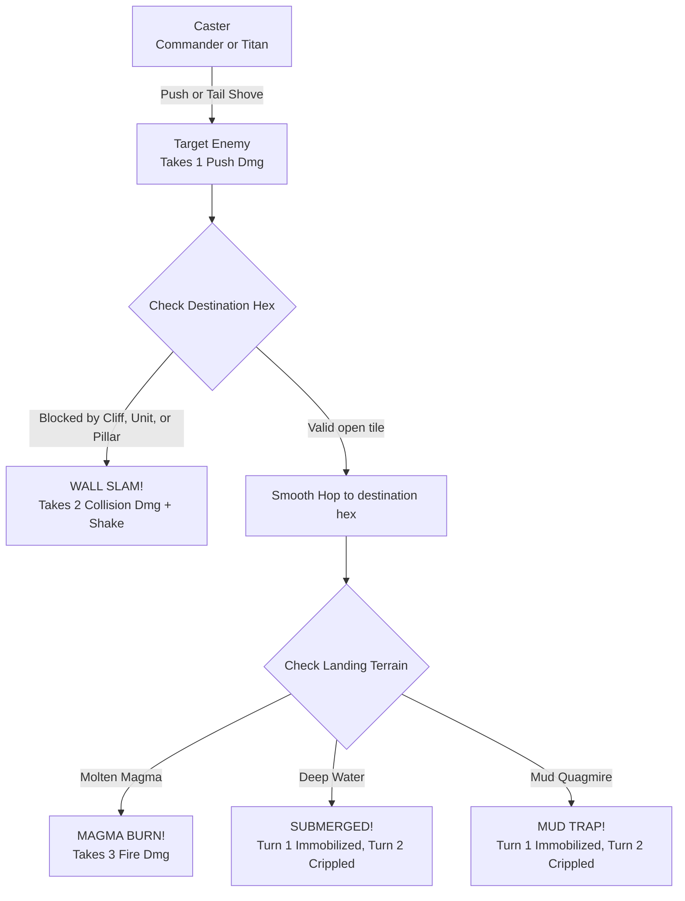

# 03. Kinetic Combat, Wall Slams & Hazards

In **Elemental Hex Tactics 3D**, pushing enemies around is basically where all the tactical dopamine comes from. Borrowing from *Into the Breach*, manipulating enemy positions and forcing violent collisions is often way more effective than chipping away with basic attacks.

---

## The Kinetic Push Mechanic

Push logic is handled in [`PushMechanic3D.cs`](https://github.com/NealversePrime/ElementalHexTactics3D/blob/main/Assets/Scripts/Combat/PushMechanic3D.cs):



### Directional Math
When you push someone, `PushMechanic3D.GetPushDirection()` takes the vector between caster and target:

```text
PushDirection = TargetHex - CasterHex
```

Since the caster has to be adjacent, the push always snaps cleanly to one of the 6 hex diagonals. The target hops 1 hex backward along that trajectory.

---

## Wall Slam Collision Physics

A push is considered **Blocked** if any of these happen:
1. **Map Boundary:** Destination tile is off the edge of the plateau.
2. **Occupied Tile:** Another unit is already standing there (no stacking allowed).
3. **High Cliff:** The target tile is more than 1 elevation step higher (`deltaElevation > 1`).
4. **Stone Pillar:** The tile has an active `TileState.StonePillar`.

### What happens on impact:
* The unit **stops moving** immediately.
* Takes **`💥 WALL SLAM! -2`** bonus collision damage on top of the push damage.
* Camera kicks with a directional jolt (`TacticalCameraController.Shake(0.32f, 0.35f)`).
* Procedural rock shards and spark particles spray outward (`CombatVFXManager.PlayWallSlam`).
* Heavy impact audio triggers (`SoundManager3D.PlaySlam(1.3f)`).

> **Design Tip (The Pillar Slam):**  
> Don't wait for a wall to be there—make your own. Cast `Earth Spire` right behind an enemy on Turn 1, then hit them with `Push` or the Titan's `Tail Shove` to smash them backward into your fresh pillar. Instant 3 damage combo!

---

## Mobility Denial: Deep Water & Mud Traps

In early prototypes, water and mud just dealt flat damage or reduced move by 1. Nobody cared—playtesters just walked right thru it. 

So I redesigned it into **progressive turn-denial**:

### 1. `⛓️ Immobilized` (Turn 1):
* **Move Range = 0.** 
* The unit literally cannot move during its turn. They can still attack or cast spells if something is in range, but they are stuck in place.
* Floating text pops up: `🌊 SUBMERGED!` or `💩 MUD TRAP!`.
* Base ring glows clay-brown (`#BF7333`).

### 2. `🦶 Crippled` (Turn 2):
* **Move Range capped at 1.**
* The unit can finally crawl 1 hex to try and scramble onto dry land.
* Floating text: `CRIPPLED (Move: 1)`.

> **Dev Note:**  
> Shoving a high-threat enemy into Deep Water on Turn 1 completely deletes their next turn's advance. It feels so mean, but in a tactical game that's exactly what you want.

---

## Elemental & Archetype Immunities

Not everyone gets stuck in the mud:

| Hazard / Trap | Normal Mortals | Water-Attuned Units | Colossal Titans |
| :--- | :--- | :---: | :---: |
| **Molten Magma** | 3 Burn Damage | ❌ Burns | ✅ **Immune** (Molten scales) |
| **Deep Water (Tier 2)** | Submerged (Immobilize + Cripple) | ✅ **Immune** (Swims freely) | ✅ **Immune** (Too tall to drown) |
| **Mud Quagmire** | Mud Trap (Immobilize + Cripple) | ❌ Trapped | ✅ **Immune** (Tramples through) |
