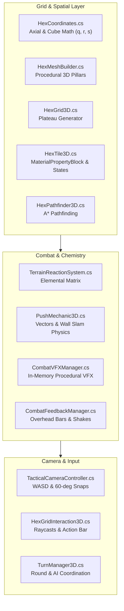

# 05. Technical Architecture & Systems Design

Under the hood, **Elemental Hex Tactics 3D** is engineered to be lightweight, performant, and completely self-contained in **Unity 6 (6000.0 URP)**.

---

## Architecture Overview



---

## Why Zero External Asset Store Packages?

One of my core technical goals: **the project must clone and run straight out of the box.** 

No 4GB asset store packages. No broken third-party DLLs. No paid plugins that break every time Unity pushes a patch.

### How it actually works:
1. **Procedural 3D Hex Meshes (`HexMeshBuilder.cs`):**
   * Pointy-topped hexagonal 3D pillars are built purely in code at runtime.
   * Generates two submeshes per tile:
     * **Submesh 0 (Top Surface):** Normalized square UVs `[0, 1]` so standard terrain textures wrap without ugly seams.
     * **Submesh 1 (Pillar Walls):** 6 vertical cliff quads with continuous vertical UVs.
2. **Procedural In-Memory Particle Textures (`CombatVFXManager.cs`):**
   * Rather than importing 50 particle PNGs, textures are baked directly into memory via C# `Texture2D`:
     * **Soft Glow:** 64x64 radial gradient for embers and core halos.
     * **Star Spark:** 64x64 four-point optical cross for melee wall-slam impacts.
     * **Cloud Puff:** 64x64 multi-frequency billow for steam and smokescreens.
   * Driven by native URP `Particles/Unlit` materials.
3. **Unity 6 ParticleSystem Safety Wrapper:**
   * *(Dev Note: Spent an entire Saturday wondering why Unity 6 was spamming console warnings every time I tweaked a particle system at runtime. Turns out Unity 6 hates modifying duration on active systems. Wrote an atomic helper that stops and clears before modifying modules — zero warnings since!)*

---

## HD-2D Visual Stack (*Triangle Strategy* Style)

The miniature tabletop aesthetic runs on our URP Volume Profile:

* **Tilt-Shift Bokeh Depth of Field:** Focus distance 12.0m, focal length 65mm, aperture f/3.2. Centers the focus on the active tactical plateau while the surrounding abyss blurs into creamy bokeh.
* **Radiant Bloom:** Threshold 0.85, intensity 1.15. Makes magma fissures, burning embers, and spell impacts spill vibrant light over neighboring tile edges.
* **ACES Tonemapping:** Contrast 18, saturation 15. Gives shadows deep contrast and makes saturated elemental hues pop like a Japanese tactics RPG.

---

## Performance & Zero-GC Memory Tricks

To keep it locked at 60+ FPS without garbage collection hiccups:

1. **`MaterialPropertyBlock` Everywhere:**
   * All per-tile color tinting (hover highlights, mud brown, scorched black) uses `MaterialPropertyBlock`.
   * **Zero `renderer.material` calls.** Calling `renderer.material` duplicates materials in memory and creates GC spikes. With property blocks, all 60+ tiles share the exact same material instance while looking totally unique.
2. **UI Click-Through Prevention:**
   * In `HexGridInteraction3D.cs`, custom GUI buttons consume clicks via `Event.current.Use()`.
   * Raycasts always check `IsPointerOverUI()` before firing, so clicking an Action Bar button never accidentally commands a unit in the 3D world behind it.
3. **O(1) Hex Coordinate Distance:**
   * `HexCoordinates.cs` uses cube coordinates `(q, r, s)` where $q + r + s = 0$. Manhattan distance between any two tiles is a single instantaneous formula:
   ```csharp
   public static int Distance(HexCoordinates a, HexCoordinates b) {
       return (Mathf.Abs(a.Q - b.Q) + Mathf.Abs(a.R - b.R) + Mathf.Abs(a.S - b.S)) / 2;
   }
   ```
