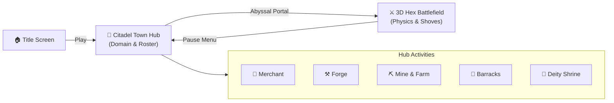

# 🏰 06. Citadel Town Hub, Domain Economy & Roadmap

Official documentation for the **Citadel Town Hub ("Citadel of the Outcasts at the Edge of the World")**, the 4-currency economic ecosystem (*The Golden Quadrant*), the asymmetrical equipment commerce system, and the realized vs. unrealized feature roadmap.

---

## 🧭 1. Vision Summary & Macro Game Loop

**Elemental Hex Tactics 3D** combines reactive elemental hex tactics (*Divinity: Original Sin 2*, *Into the Breach*) with domain management and monster squad conquest (*Brigandine: The Legend of Runersia*).

---

## ✅ 2. Realized Features (Currently Implemented)

All items below have been fully developed, validated, and are active in `Assets/Scenes/SampleScene.unity`:

### A. 2D Interactive Citadel Town Hub
* **Master Backdrop Canvas (`full.png`):** Utilizes a unified 1920x1080 master canvas combining three visual layers: background scenery, 6 facility structures, and a foreground stone road strip, anchoring all building foundations naturally to the ground without floating.
* **Pixel-Perfect Building Hotspot Overlays:**
  1. **👑 Demon Lord Citadel:** `Pos (-753.3, 122.8)`, `Size 735 x 735` (Scale 1.47x).
  2. **⚒️ Emancipation Forge:** `Pos (-395.6, -72.6)`, `Size 385 x 385` (Scale 0.77x).
  3. **🌀 Abyssal Rift Portal:** `Pos (-26.5, -53.5)`, `Size 427 x 427` (Scale 1.00x).
  4. **🐺 Monster Barracks & Den:** `Pos (313.5, -55.5)`, `Size 449 x 449` (Scale 1.00x).
  5. **⛏️ Mana Mine & Spore Farms:** `Pos (643.2, -136.4)`, `Size 492.5 x 488.8` (Scale 1.25x).
  6. **🔮 Ancient Deity Shrine:** `Pos (786.0, 174.0)`, `Size 348 x 348` (Scale 1.00x).
* **Alpha Feathering:** The bottom 15–20 pixels of `blacksmith.png` and `demontower.png` feature smooth alpha feathering gradients, eliminating harsh horizontal crop lines and seamlessly dissolving into road rocks upon hover.
* **Interactive Hover Radiance & Dynamic Tooltips:** Hovering over any building activates a gentle golden radiance (`alpha = 0.55`) and triggers a responsive top banner detailing facility lore and actions.
* **Interactive Facility Modals:** Clicking on buildings opens dedicated modal dialogs with flavor descriptions and action buttons.
* **3D Expedition Transition:** Clicking the Abyssal Portal smoothly embarks the party directly onto the 3D hexagonal battlefield.
* **Pause Menu & Citadel Return:** The in-battle pause menu provides a *Return to Citadel* option that transitions back to the Town Hub without reloading the scene.
* **Self-Healing Runtime Cleanup:** `TownHubManager.cs` and `TitleMenuCanvasUI.cs` automatically purge legacy shadow quads (`Container_GroundShadows`) and synchronize building node coordinates upon game start.

---

## 📋 3. Unrealized Features (Design Backlog & Roadmap)

This section details game systems that have been conceptually designed and balanced, queued for future milestone implementation:

### A. The 4-Currency Ecosystem (*The Golden Quadrant*)
1. **💰 Gold (Universal Commerce Currency):**
   - *Design Philosophy:* *"Gold is gold; merchants do not discriminate."* Accepted by pragmatic, neutral traders regardless of the buyer's race or faction.
   - *Primary Sink:* Purchasing ready-made equipment (Weapons, Armor, Hazard Boots, Tactical Goggles, Monster Relics, Spell Scrolls).
   - *Sources:* Battle victory bounties, intercepted Holy Empire convoys, and selling salvaged scrap.
2. **🍖 Food (Sustenance & Troop Logistics):**
   - *Function 1 (Monster Upkeep ala Brigandine):* Daily sustenance cost for monsters stationed at the barracks. If food runs out, monsters suffer *Starvation* (AP penalties and reduced morale, never permanent death).
   - *Function 2 (War Banquet / Feast Buffs):* Cooking pre-battle meals that grant hazard resistances (e.g. *Lava Stew* for magma immunity in volcanic biomes).
   - *Sources:* Regular harvests from the *Fungal Farm* terraces and hunting expeditions.
3. **💎 Mana Stone (Arcane Catalysts & Construction):**
   - *Function:* Upgrading Citadel facilities, unlocking doctrine tech trees, and funding **Elemental Infusions** at the Forge (infusing plain gear with Fire, Water, or Earth affinities).
   - *Sources:* Passive extraction from the *Mana Mine*, or actively harvested in battle via the **`Siphon`** ability on elemental tiles.
4. **🪽 Angel Core (Divine Relic / Apex Trophy Currency):**
   - *Function:* Sacrificial fuel to awaken Ancient Titans at the *Ancient Deity Shrine (Gacha)*, and neutralizing high-tier cursed slave collars (*Arch-Inquisitor Collars*) at the Forge.
   - *Sources:* Defeating Holy Empire Angels, Seraphim, and Grand Inquisitors.

---

### B. Merchant System (Direct Purchase vs. Forge Crafting)
* **Resident Quartermaster:** Stationary merchant providing baseline weapons and standard provisions.
* **Wandering Rift-Cart:** Periodic nomadic traders selling exotic hazard-navigation gear (*Lava Walkers*, *Miasma Respirators*, *Scroll of the Vortex*).
* **Clear Functional Division:**
  - **Merchant (Gold):** Instant purchase of finished goods ready for combat.
  - **Forge (Mana Stone & Angel Cores):** Upgrading stats, elemental infusions, custom socketing, and shattering slave collars.

---

### C. Asymmetrical Equipment & Size Taxonomy (Small, Normal, Big)

Units are organized into 3 size categories with fundamentally distinct equipment slot allocations:

#### 1. Normal: Humanoid / Shaper (Commanders) — 5 Full RPG Slots
Shaper equipment determines **"Which element is infused"** and **"Where the unit can step"**.
* **Weapon:** Governs the element infused on attack (e.g. *Inferno Hammer* → Infuse Scorched Earth; *Tidecaller Staff* → Infuse Water Puddle).
* **Boots:** Hazard navigation and mobility (e.g. *Lava Walkers* → walk across Magma unharmed; *Frost-Grip Soles* → immune to slipping on Ice).
* **Helm:** Vision protection and atmospheric counters (e.g. *Steam-Piercer Goggles* → immune to Blind in Steam/Smoke; *Miasma Respirator* → poison gas immunity).
* **Armor:** Standard physical and magical mitigation.
* **Accessory:** Turn order and initiative manipulation (e.g. *Haste Ring* → act earlier to terraform the map before monsters move).

#### 2. Big: Colossal Titans (Ancient Monsters) — 3 Specialist Slots
Titan equipment focuses on **Biome Adaptation** and **Rule Breaking**.
* **Relic (1 Slot):** *Stat Stick* boosting raw attributes (e.g. *Titan Heart* → +500 HP, +50 ATK).
* **Scroll 1 (Biome Adaptation):** Environmental shaping (e.g. *Scroll of Inner Fire* → spawns Scorched Earth underfoot each turn; *Scroll of Tides* → swim freely through Deep Water).
* **Scroll 2 (Rule Breaking):** Game rule manipulation (e.g. *Scroll of the Vortex* → expands `Consume Land` radius to 2 hexes and disperses smoke; *Scroll of Seismic Weight* → complete knockback immunity).

#### 3. Small: Minions & Demi-Humans (Outcasts) — 1–2 Aux / Worker Tool Slots
Rescued demi-humans and compact minions.
* **Aux / Trinket (1 Slot):** Agility charms or combat tricks (e.g. *Shadow Cloak* → stealth in Steam clouds; *Spike Trap Pouch* → plant spikes on tiles).
* **Worker Tool (Domain Role):** Equipping enchanted pickaxes or gardening trowels to boost daily yields when assigned to the *Mana Mine & Farm*.

---

### D. Ancient Deity Shrine Summoning System (*Titan Awakening*)
* Sacrifice `Angel Cores` at the purple brazier to awaken legendary Titans with tiered rarity rates.
* Summoned Titans boast massive size, innate hazard immunities, high durability, and catastrophic ultimate abilities (*Consume Land / Cataclysm*).

---

## ⚖️ 4. Scope & Bloat Risk Analysis

### Does This Broaden the Scope Into "Feature Bloat"?
**Short Answer: No, as long as systems are interlocking rather than isolated chores.**

| "Bloated" Design (Anti-Pattern) | "Cohesive Depth" (Our Game) |
| :--- | :--- |
| 10+ confusing currencies with overlapping utility. | **Strictly 4 orthogonal currencies:** Gold (market), Food (army), Mana (base/magic), Core (bosses/gacha). |
| Farming and mining are tedious minigames divorced from war. | **Passive assignment:** Assign rescued outcasts to facilities to support your army's food and mana needs. |
| Equipment merely adds generic incremental stat inflation (+5 ATK). | **Equipment solves tactical puzzles:** Lava boots allow walking across magma; goggles allow shooting through steam! |

### Phased Execution Strategy:
1. **Milestone 1 (Foundation - COMPLETED):** Interactive 2D Citadel Hub, Canva master integration, and seamless 3D battle transitions.
2. **Milestone 2 (Liquidity & Shop):** Enable Gold and basic merchant rosters to buy elemental infusion weapons and hazard boots.
3. **Milestone 3 (Logistics & Workforce):** Implement Food harvests, worker assignments, and monster upkeep costs.
4. **Milestone 4 (Meta Endgame):** Implement Angel Core boss drops and the Ancient Deity Shrine titan awakening ritual.

---

*Authored by Elang Esa Yudhistira (Neal Sage / NealversePrime) — Solo Game Designer & Programmer.*
