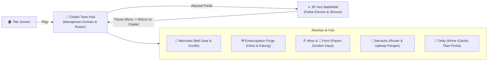

# 🏰 06. Citadel Town Hub, Domain Economy & Roadmap

Dokumentasi resmi untuk **Citadel Town Hub ("Citadel of the Outcasts at the Edge of the World")**, arsitektur ekonomi 4 mata uang (*The Golden Quadrant*), sistem toko perlengkapan asimetris, serta roadmap fitur yang sudah terealisasi vs belum terealisasi.

---

## 🧭 1. Ringkasan Visi & Game Loop Makro

Elemental Hex Tactics 3D menggabungkan taktis heksagonal berbasis fisika elemen (*Divinity: Original Sin 2*, *Into the Breach*) dengan manajemen domain dan pasukan monster (*Brigandine: The Legend of Runersia*).

---

## ✅ 2. Fitur yang Sudah Terealisasi (Implemented)

Semua poin di bawah ini telah selesai dikembangkan dan aktif di dalam scene `Assets/Scenes/SampleScene.unity`:

### A. 2D Interactive Citadel Town Hub
* **Master Backdrop Canva (`full.png`):** Menggunakan karya kanvas 1920x1080 yang menggabungkan 3 lapisan: pemandangan belakang, 6 bangunan fasilitas, dan lapisan jalan batu depan (*foreground road strip*) sehingga fondasi bangunan menancap alami tanpa melayang.
* **Pixel-Perfect Building Hotspot Overlays:**
  1. **👑 Demon Lord Citadel:** `Pos (-753.3, 122.8)`, `Size 735 x 735` (Skala $1.47\times$).
  2. **⚒️ Emancipation Forge:** `Pos (-395.6, -72.6)`, `Size 385 x 385` (Skala $0.77\times$).
  3. **🌀 Abyssal Rift Portal:** `Pos (-26.5, -53.5)`, `Size 427 x 427` (Skala $1.00\times$).
  4. **🐺 Monster Barracks & Den:** `Pos (313.5, -55.5)`, `Size 449 x 449` (Skala $1.00\times$).
  5. **⛏️ Mana Mine & Spore Farms:** `Pos (643.2, -136.4)`, `Size 492.5 x 488.8` (Skala $1.25\times$).
  6. **🔮 Ancient Deity Shrine:** `Pos (786.0, 174.0)`, `Size 348 x 348` (Skala $1.00\times$).
* **Alpha Feathering:** 15–20 pixel terbawah pada sprite `blacksmith.png` dan `demontower.png` telah di-feathering sehingga garis potongan lurus horizontal hilang dan larut mulus ke dalam bebatuan jalan saat di-hover.
* **Efek Interaktif & Tooltip Banner:** Hover menampilkan *golden radiance* lembut (`alpha = 0.55`) dan memunculkan banner status di bagian atas layar.
* **Modal Fasilitas:** Menampilkan dialog interaktif untuk kelima fasilitas domain dan tombol aksi.
* **Transisi Ekspedisi 3D:** Mengklik Abyssal Portal langsung memberangkatkan pasukan ke medan tempur 3D heksagonal.
* **Menu Pause & Kembali:** Tombol *Return to Citadel* di menu jeda mengembalikan pemain ke Town Hub secara mulus tanpa reload scene.
* **Pembersihan Otomatis (*Self-Healing Runtime*):** Script `TownHubManager.cs` dan `TitleMenuCanvasUI.cs` otomatis memusnahkan sisa kotak bayangan lama (`Container_GroundShadows`) dan menyinkronkan posisi koordinat saat game dijalankan.

---

## 📋 3. Fitur yang Belum Terealisasikan (Design Backlog & Roadmap)

Bagian ini merangkum sistem-sistem yang telah selesai dirancang secara konseptual namun belum diimplementasikan ke dalam kode gameplay:

### A. Ekosistem 4 Mata Uang (*The Golden Quadrant*)
1. **💰 Gold (Emas Perdagangan Universal):**
   - *Filosofi:* *"Gold is gold, merchant tidak pandang bulu."* Diterima oleh pedagang netral mana pun tanpa memandang faksi/ras pembeli.
   - *Fungsi:* Membeli perlengkapan jadi (Senjata, Zirah, Sepatu anti-hazard, Kacamata taktis, Relik monster, Gulungan sihir).
   - *Sumber:* Jarahan kemenangan tempur, konvoi Kekaisaran, dan penjualan barang bekas.
2. **🍖 Food (Pangan & Logistik Pasukan):**
   - *Fungsi 1 (Monster Upkeep ala Brigandine):* Biaya pemeliharaan harian monster di barak. Jika cadangan Food kosong, pasukan mengalami status *Starvation* (penalti AP dan penurunan moral, bukan kematian permanen).
   - *Fungsi 2 (War Banquet / Feast Buffs):* Memasak hidangan sebelum perang untuk memberi buff ketahanan elemen/hazard (contoh: *Lava Stew* untuk kebal api di biome magma).
   - *Sumber:* Panen berkala di teras perkebunan *Fungal Farm* dan ekspedisi perburuan.
3. **💎 Mana Stone (Batu Mana & Katalis Arkanum):**
   - *Fungsi:* Menaikkan tier fasilitas Citadel, membuka pohon teknologi doktrin, serta biaya **Elemental Infusion** di Forge (menginfus senjata polos menjadi berelemen Api, Air, Tanah).
   - *Sumber:* Ditambang pasif dari *Mana Mine*, atau diserap aktif saat bertarung via skill **`Siphon`** pada tile heksagonal.
4. **🪽 Angel Core (Inti Malaikat / Trofi Puncak):**
   - *Fungsi:* Kurban ritual pemanggilan Titan Purba di *Ancient Deity Shrine (Gacha)*, serta melebur segel kalung budak kasta tinggi (*Arch-Inquisitor Cursed Collars*).
   - *Sumber:* Membantai Bos Malaikat, Seraphim, dan Inkuisitor Tinggi Kekaisaran Suci.

---

### B. Sistem Merchant (Belanja Jadi vs Penempaan)
* **Toko Permanen (*Resident Quartermaster*):** Menyediakan perlengkapan dasar hingga menengah.
* **Karavan Keliling (*Wandering Rift-Cart*):** Muncul berkala membawa barang-barang spesialis penangkal biome ekstrem (*Lava Walkers*, *Miasma Respirator*, *Scroll of the Vortex*).
* **Perbedaan Peran:**
  - **Merchant (Gold):** Membeli barang jadi langsung pakai.
  - **Forge (Mana Stone & Core):** Menempa ulang, meng-upgrade stat, menginfus elemen baru, dan memecahkan kalung belenggu budak.

---

### C. Taksonomi Perlengkapan & Ukuran Asimetris (Small, Normal, Big)

Sesuai dokumen konsep, seluruh unit terbagi menjadi 3 kategori ukuran dengan alokasi slot peralatan yang berbeda secara fundamental:

#### 1. Normal: Humanoid / Shaper (Komandan) — 5 Slot RPG Lengkap
Peralatan Shaper menentukan **"Elemen apa yang diinfus"** dan **"Di mana mereka bisa melangkah"**.
* **Weapon:** Menentukan elemen yang diinfus saat serangan mengenai tile (contoh: *Inferno Hammer* $\rightarrow$ Infuse Scorched Earth; *Tidecaller Staff* $\rightarrow$ Infuse Water Puddle).
* **Boots:** Navigasi bahaya medan / hazard traversal (contoh: *Lava Walkers* $\rightarrow$ berjalan di atas Magma tanpa terbakar; *Frost-Grip Soles* $\rightarrow$ tidak tergelincir di Ice Sheet).
* **Helm:** Penangkal awan atmosfer & gangguan visual (contoh: *Steam-Piercer Goggles* $\rightarrow$ kebal Blind di awan Steam/Smoke; *Miasma Respirator* $\rightarrow$ kebal racun gas).
* **Armor:** Mitigasi pertahanan fisik dan sihir standar.
* **Accessory:** Manipulasi giliran (*Turn Order*) dan inisiatif (contoh: *Haste Ring* $\rightarrow$ bertindak lebih awal untuk menata medan sebelum monster bergerak).

#### 2. Big: Colossal Titans (Monster Purba) — 3 Slot Perlengkapan Spesialis
Peralatan Titan berfokus pada **Adaptasi Biome** dan **Memecah Aturan (*Rule Breaking*)**.
* **Relic (1 Slot):** *Stat Stick* peningkat atribut dasar (contoh: *Titan Heart* $\rightarrow$ +500 HP, +50 ATK).
* **Scroll 1 (Biome Adaptation):** Kemampuan adaptasi lingkungan (contoh: *Scroll of Inner Fire* $\rightarrow$ memunculkan Scorched Earth di bawah kaki tiap turn; *Scroll of Tides* $\rightarrow$ bisa berenang di Deep Water).
* **Scroll 2 (Rule Breaking):** Memanipulasi aturan dasar permainan (contoh: *Scroll of the Vortex* $\rightarrow$ memperluas jarak skill `Consume Land` menjadi 2 Hex dan meniup awan asap; *Scroll of Seismic Weight* $\rightarrow$ kebal didorong/shove musuh).

#### 3. Small: Minions & Demi-Humans (Outcasts) — 1–2 Slot Aux / Worker Tools
Monster kecil dan budak yang diselamatkan dari belenggu Kekaisaran Suci.
* **Aux / Trinket (1 Slot):** Jimat kelincahan atau racun (contoh: *Shadow Cloak* $\rightarrow$ kamuflase di kabut uap; *Spike Trap Pouch* $\rightarrow$ menaruh ranjau duri di hex).
* **Worker Tool (Domain Role):** Jika tidak dibawa bertarung, dapat dipasangi alat tambang/cangkul arkanum di *Mana Mine & Farm* untuk meningkatkan output panen harian.

---

### D. Sistem Gacha Altar Dewa Purba (*Ancient Deity Shrine*)
* Menumbalkan `Angel Core` di kawah api ungu untuk memanggil monster Titan legendaris dengan probabilitas tier bintang/kasta.
* Titan yang dipanggil memiliki ukuran tubuh raksasa, imunitas bawaan terhadap hazard tertentu, dan skill pamungkas memakan lahan (*Consume*).

---

## ⚖️ 4. Analisis Risiko Bloat & Strategi Mitigasi

### Apakah Fitur-Fitur Ini Membuat Game Menjadi "Bloat"?
**Jawaban Singkat: Tidak, asalkan sistemnya saling terhubung (*interlocking*), bukan berdiri sendiri sebagai beban (*isolated chore*).**

| Sistem "Bloat" (Buruk) | Sistem "Cohesive Depth" (Game Kita) |
| :--- | :--- |
| Memiliki 10+ mata uang yang fungsinya mirip dan membingungkan pemain. | **Tepat 4 mata uang orthogonal:** Gold (pasar), Food (pasukan), Mana (basis/sihir), Core (bos/gacha). |
| Farming/Mining adalah minigame membosankan yang terpisah dari perang. | **Farming/Mining pasif sederhana:** Cukup tempatkan pekerja outcasts untuk menyuplai upkeep pasukan. |
| Equipment hanya menambah angka stat generik (+5 ATK, +3 DEF). | **Equipment memecahkan puzzle taktis:** Sepatu lava agar bisa lewat magma, kacamata agar bisa menembak menembus uap! |

### Strategi Eksekusi Bertahap (Mencegah Over-Engineering):
1. **Milestone 1 (Fondasi - SELESAI):** Hub 2D interaktif, integrasi visual Canva, dan transisi ke pertempuran 3D.
2. **Milestone 2 (Likuiditas & Toko):** Mengaktifkan Gold dan merchant sederhana untuk membeli beberapa variasi senjata Infuse elemen dan sepatu anti-hazard.
3. **Milestone 3 (Upkeep & Sektor Pekerja):** Mengaktifkan panen Food dan sistem upkeep barak monster.
4. **Milestone 4 (Puncak Meta):** Mengaktifkan Angel Core drop dari Bos dan ritual gacha Titan di Altar.

