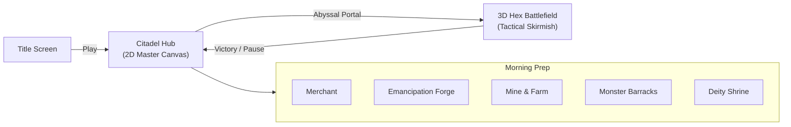

# 06. Citadel Town Hub, Domain Economy & Roadmap

This page covers the **Citadel Town Hub ("Citadel of the Outcasts at the Edge of the World")**, the 4-currency economic loop (*The Golden Quadrant*), equipment taxonomy, and what's actually built vs. still in the backlog.

---

## Macro Game Loop

> **Design Rationale (Why a 2D Canvas Hub instead of 3D?):**  
> Making a 3D town where the player has to physically walk a character between the blacksmith and the tavern would have taken 4 months of modeling, rigging, and pathfinding just to let someone open a shop menu. The 2D master canvas (`full.png`) with pixel-perfect clickable building overlays looks gorgeous, loads in 0.1 seconds, and gets players straight into the tactical fun.

---

## What's Built & Working Right Now

All of this is currently implemented and live in `Assets/Scenes/SampleScene.unity`:

### 2D Interactive Citadel Canvas (`TownHubManager.cs`)
* **Unified Master Backdrop (`full.png`):** 1920x1080 master illustration combining background scenery, 6 structures, and a foreground stone road.
* **Exact Building Hotspot Overlays:**
  1. **Demon Lord Citadel:** `Pos (-753.3, 122.8)`, `Size 735 x 735` (Scale 1.47x).
  2. **Emancipation Forge:** `Pos (-395.6, -72.6)`, `Size 385 x 385` (Scale 0.77x).
  3. **Abyssal Rift Portal:** `Pos (-26.5, -53.5)`, `Size 427 x 427` (Scale 1.00x).
  4. **Monster Barracks & Den:** `Pos (313.5, -55.5)`, `Size 449 x 449` (Scale 1.00x).
  5. **Mana Mine & Spore Farms:** `Pos (643.2, -136.4)`, `Size 492.5 x 488.8` (Scale 1.25x).
  6. **Ancient Deity Shrine:** `Pos (786.0, 174.0)`, `Size 348 x 348` (Scale 1.00x).
* **Alpha Feathering:** The bottom 15–20 pixels of `blacksmith.png` and `demontower.png` feature smooth alpha gradients so they dissolve seamlessly into the road cobblestones without ugly hard crop lines when hovered.
* **Hover Radiance & Tooltips:** Hovering any building lights up golden radiance (`alpha = 0.55`) and drops a responsive top banner with facility lore. Clicking opens interactive modals.
* **Seamless 3D Battle Embarkation:** Clicking the Portal embarks the party directly onto the 3D hexagonal battlefield without an annoying scene reload.

---

## The Design Backlog & What's Next

### 1. The 4-Currency Ecosystem (*The Golden Quadrant*)
* **💰 Gold (Universal Market Currency):**
  * *"Gold is gold; merchants don't care who you are."* Used by neutral nomadic traders.
  * *Sink:* Ready-made equipment (weapons, boots, goggles, spell scrolls).
  * *Faucet:* Battle victory bounties, plundered Imperial convoys, salvaged scrap.
* **🍖 Food (Troop Sustenance & Feast Buffs):**
  * *Function 1 (Monster Upkeep):* Daily food cost for beasts stationed at the barracks. If food runs out, monsters suffer hunger AP penalties (no permadeath, just reduced combat effectiveness).
  * *Function 2 (Pre-Battle Feasts):* Cook meals before expeditions for temporary hazard immunity (e.g. *Lava Stew* for magma resistance).
  * *Faucet:* Harvested from the *Fungal Farm* terraces and beastfolk hunting parties.
* **💎 Mana Stone (Infusions & Base Tech):**
  * *Sink:* Facility upgrades, tech trees, and forging elemental infusions on weapons.
  * *Faucet:* Extracted from the *Mana Mine*, or actively harvested in battle via **`Siphon Land`**.
* **🪽 Angel Core (Apex Trophy Currency):**
  * *Sink:* Awaken Colossal Titans at the *Deity Shrine*, and neutralize cursed slave collars at the *Forge*.
  * *Faucet:* Dropped by high-tier Imperial Inquisitors, Cherubs, and Seraphim.

---

### 2. Asymmetrical Equipment by Unit Size

Units have different equipment slot layouts based on their physical scale:

* **Normal (Humanoid Shapers — 5 Full RPG Slots):**
  * Equipment controls *"which element is infused"* and *"where you can step"*:
  * **Weapon:** Infuses terrain on attack (e.g. *Inferno Hammer* $\rightarrow$ Scorched Earth).
  * **Boots:** Hazard traversal (e.g. *Lava Walkers* $\rightarrow$ walk on magma; *Frost Soles* $\rightarrow$ no slipping).
  * **Helm:** Vision protection (e.g. *Steam-Piercer Goggles* $\rightarrow$ aim through smokescreens).
  * **Armor:** Physical/magic mitigation.
  * **Accessory:** Turn order and initiative control.
* **Big (Colossal Titans — 3 Specialist Slots):**
  * **1 Relic:** Stat booster (e.g. *Titan Heart* $\rightarrow$ +HP, +ATK).
  * **2 Biome/Rule Scrolls:** Environmental rule-breakers (e.g. *Scroll of Inner Fire* $\rightarrow$ leaves magma trails; *Scroll of Seismic Weight* $\rightarrow$ 100% knockback immunity).
* **Small (Minions & Demi-Humans — 1–2 Aux / Tool Slots):**
  * **1 Trinket:** Agility charm or combat trick (e.g. *Shadow Cloak* $\rightarrow$ stealth in steam).
  * **1 Worker Tool:** Enchanted pickaxes or trowels to boost daily yields when assigned to the Mine/Farm.

---

## Anti-Bloat Scope Rules

| Bad Idea (Scope Creep) | Good Idea (What We're Doing) |
| :--- | :--- |
| 10 confusing currencies with overlapping uses. | **Strictly 4 orthogonal currencies:** Gold (market), Food (army), Mana (magic), Angel Cores (boss trophy). |
| Complex farming and mining minigames. | **Passive assignment:** Assign outcasts to facilities to auto-generate food and mana. |
| Generic stat-inflation equipment (+3 attack). | **Equipment solves tactical problems:** Lava boots let you cross lava; goggles let you shoot through smoke. |
