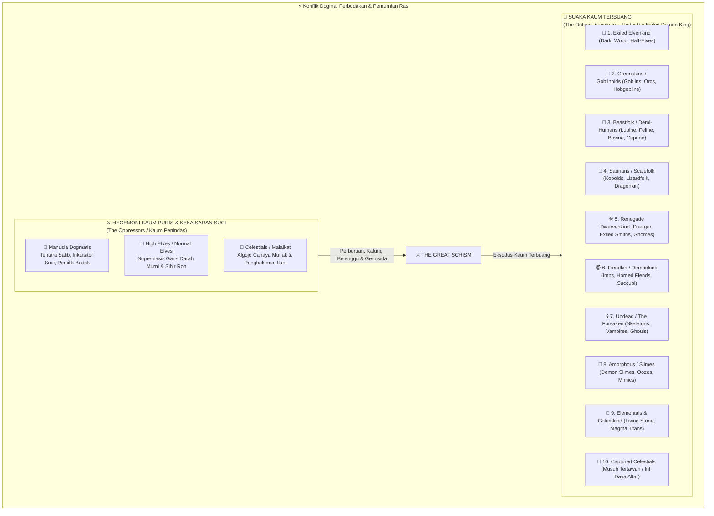
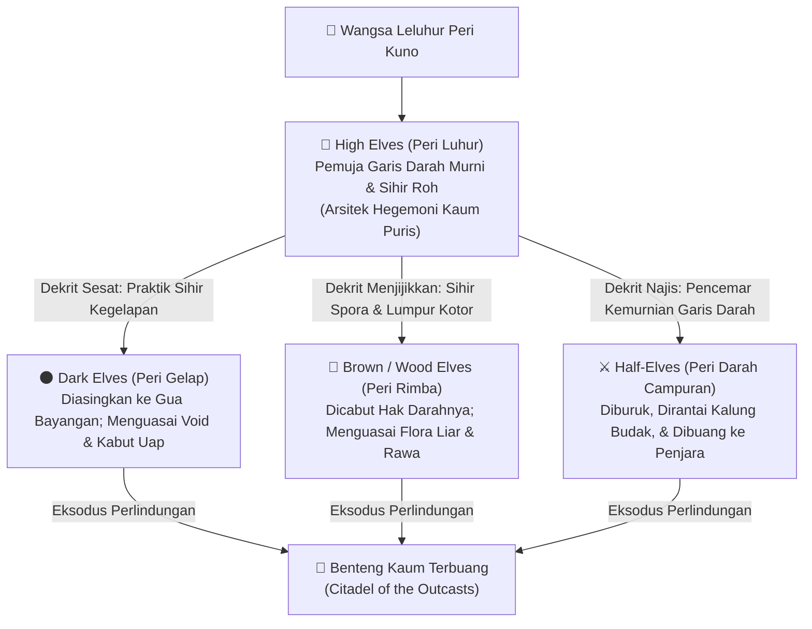
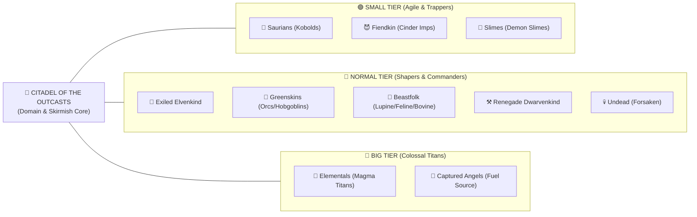
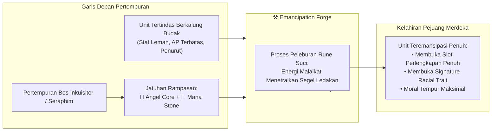
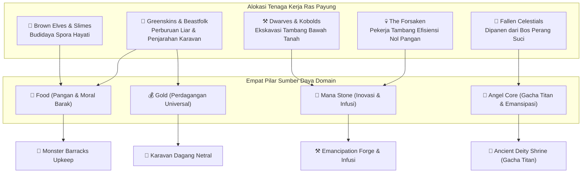

# 🌍 07. Broad Fantasy Races, Faction Schism & Tactical Taxonomy

Dokumentasi ensiklopedia komprehensif mengenai **10 Pilar Ras Payung Fantasi (*The 10 Broad Species Pillars*)**, doktrin perang, perpecahan ideologis dunia (*The World Schism*), tragedi pengusiran wangsa peri (*The Exiled Elven Schism*), serta interaksi mekanik setiap ras di atas medan tempur heksagonal dan domain ekonomi Citadel.

---

## 🧭 1. Skisma Besar Dunia: Hegemoni Kaum Puris vs Suaka Kaum Terbuang

Dunia *Elemental Hex Tactics 3D* terbelah secara radikal oleh dogma kekudusan absolut dan penindasan sistemik. Dua kutub peradaban saling berhadapan dalam perang asimetris abadi:

### A. Kaum Penindas (*The Oppressors*)
Hegemoni ini berakar pada teokrasi tirani yang menganggap bahwa hanya entitas dengan "darah murni" dan pancaran cahaya ortodoks yang berhak atas eksistensi berdaulat di muka bumi:
1. **👑 Humans (Kekaisaran Manusia Dogmatis):**
   - *Doktrin:* Dipimpin oleh kasta pendeta fanatik, tentara salib (*Crusaders*), dan inkuisitor (*Holy Inquisitors*).
   - *Metode Penindasan:* Arsitek utama perdagangan budak antar-benua. Mereka memasang **Kalung Sihir Terkutuk (*Cursed Slave Collars*)** pada ras-ras demi-human, goblin, dan keturunan peri terbuang untuk memeras tenaga kerja di tambang suci serta menjadikannya tameng daging di garis depan pertempuran.
2. **🧝 High Elves / Normal Elves (Peri Luhur / Peri Murni):**
   - *Doktrin:* Elitis aristokratik garis keras. Mereka memuja konsep "kemurnian darah tanpa cacat" (*pure bloodline*) dan sihir roh tingkat tinggi (*high spirit / divine arts*).
   - *Pandangan Etnis:* Mereka memandang diri mereka sebagai satu-satunya "Peri Sejati". Cabang peri lain yang menggunakan sihir bayangan atau sihir bumi liar dipandang sebagai noda memalukan yang tidak pantas menyandang identitas peri. Mereka bertindak sebagai kurator teologis yang melegitimasi genosida kaum terbuang.
3. **🪽 Celestials / Angels (Makhluk Surgawi Penegak Cahaya Mutlak):**
   - *Doktrin:* Entitas cahaya ortodoks murni yang dipanggil melalui bejana doa kekaisaran.
   - *Peran Tempur:* Bukan sekadar pelindung, melainkan algojo tanpa ampun. Bagi malaikat, kegelapan, ketidaksempurnaan bentuk fisik, serta distorsi sihir adalah dosa mutlak yang harus dibakar habis menggunakan pedang cahaya (*Divine Smite*).

---

## 🧝 2. Tragedi Skisma Peri: Pengusiran Wangsa yang Dicampakkan

Pengusiran bangsa peri dari ibu kota kanopi perak (*The Sylvan Highspire*) bukan terjadi karena perang saudara terbuka, melainkan dekrit pemurnian sepihak oleh para tetua **High Elves**.

### Cabang Wangsa Peri yang Dibuang ke Suaka:
1. **🌑 Dark Elves (Peri Kegelapan / Drow Terbuang):**
   - *Alasan Dibuang:* Menolak doktrin ortodoks dan berani mempelajari sihir tabu kegelapan, bayangan, dan kehampaan (*Shadow/Void magic*) untuk memahami keseimbangan kosmik. Dianggap bersekutu dengan kegelapan kosmik dan diusir dari kanopi suci.
   - *Adaptasi di Suaka:* Menjadi ahli intrik, spionase, dan penembak runduk dalam kabut.
2. **🍄 Brown / Wood Elves (Peri Rimba / Peri Tanah Liar):**
   - *Alasan Dibuang:* Menolak ritual sihir roh para bangsawan yang steril. Mereka memeluk alam mentah apa adanya: tanah basah liar, kebusukan kayu purba, spora jamur bawah tanah, dan flora pemakan bangkai (*raw earth, flora, spores, and fungal nature*). Dianggap biadab, kotor, dan dicabut gelar kebangsawanannya.
   - *Adaptasi di Suaka:* Pengelola utama ketahanan pangan benteng di *Fungal Farms*.
3. **⚔️ Half-Elves (Peri Darah Campuran / Kaum Terstigma):**
   - *Alasan Dibuang:* Dianggap sebagai "pencemar kemurnian darah" (*bloodline polluters*) dan anjing bastar (*mongrels*). Anak-anak hasil kawin silang dengan manusia kelas bawah ini diburu oleh Inkuisitor Suci, dipasangi kalung budak sihir, atau dilempar ke lubang gladiator.
   - *Adaptasi di Suaka:* Garis depan perlawanan moral. Menggabungkan fleksibilitas adaptasi manusia dengan afinitas mana peri, memimpin pembebasan budak di *Emancipation Forge*.

---

## 🏰 3. Sepuluh Pilar Ras Payung Suaka (*The 10 Broad Species Pillars*)

Di bawah naungan **Exiled Demon King (Raja Iblis Terbuang)**, sepuluh pilar ras fantasi bersatu di dalam *Citadel of the Outcasts*. Masing-masing membawa identitas morfologi, peran ukuran (*Small/Normal/Big*), interaksi grid heksagonal unik, dan kontribusi domain fasilitas hub:

---

### 🧝 Pilar 1: Exiled Elvenkind (Wangsa Peri Terbuang)
* **Anggota Inti:** Dark Elves, Brown/Wood Elves, Half-Elves.
* **Kategori Ukuran:** `Normal` (Humanoid Shapers) & `Small` (Infiltrator Scouts).
* **Afinitas Elemen Utama:** `Water` (Embun/Kabut), `Earth` (Flora/Spora), `Void/Shadow`.
* **Interaksi Medan Heksagonal:**
  - **Vapor Shroud Mastery:** Memperoleh status *Camouflage* (evasion tinggi dan tidak bisa ditarget serangan jarak jauh musuh) ketika berdiri di dalam tile kabut **Steam**.
  - **Bog Trotter:** Brown Elves kebal terhadap penalti mobilitas tile **Mud (Quagmire)**; mereka melangkah di atas lumpur hisap seolah tanah padat.
* **Signature Skill Taktis:**
  - `🌑 Shadow Flicker` *(Dark Elf - 1 Core)*: Teleportasi melintasi 2 hex menuju petak yang diselimuti Steam atau bayangan pilar, diikuti tusukan belati beracun.
  - `🍄 Spore Bloom Trap` *(Wood Elf)*: Menanam jebakan spora pada hex kosong. Saat musuh melangkah, tile berubah menjadi *Mud* dan musuh langsung terkena status `⛓️ Immobilized`.
* **Kontribusi Domain Citadel:**
  - **🌾 Fungal Farms:** Brown Elves meningkatkan output harian pangan (*Food Upkeep*) benteng berkat rekayasa jamur purba.
  - **⚒️ Emancipation Forge:** Half-Elves bertindak sebagai teknisi pemecah rune pada kalung perbudakan.

---

### 🧌 Pilar 2: Greenskins & Goblinoids (Kaum Kulit Hijau)
* **Anggota Inti:** Goblins (Scrappers), Orcs (Shock Troopers), Hobgoblins (Warlords).
* **Kategori Ukuran:** `Small` (Goblin) & `Normal` (Orc / Hobgoblin).
* **Afinitas Elemen Utama:** `Earth` (Batu Kasar) & `Neutral Physical`.
* **Interaksi Medan Heksagonal:**
  - **Kinetic Impact Specialists:** Sangat terlatih dalam fisika benturan heksagonal (*Into the Breach*). Serangan dorongan mereka menghasilkan kombo hantaman mematikan.
  - **Rubble Scavenge:** Mampu meremukkan **Stone Pillar** di sebelahnya untuk dijadikan perisai darurat atau dilempar ke arah lawan.
* **Signature Skill Taktis:**
  - `💥 Brutal Shove` *(Orc Warrior)*: Mendorong musuh sejauh 1–2 hex ke belakang. Jika musuh menabrak tebing elevasi, unit lain, atau Stone Pillar, memicu **`💥 WALL SLAM! -4`** (dua kali lipat damage tabrakan standar!).
  - `🦴 Scrap Trap` *(Goblin)*: Meletakkan ranjau gerigi besi di hex. Musuh yang terdorong masuk menerima luka pendarahan dan penurunan Move Range.
* **Kontribusi Domain Citadel:**
  - **🐺 Monster Barracks:** Menjaga disiplin barak dan memimpin ekspedisi serbuan konvoi militer Kekaisaran untuk menjarah emas (*Gold*).

---

### 🐺 Pilar 3: Beastfolk & Demi-Humans (Siluman Rimba & Kaum Setengah Manusia)
* **Anggota Inti:** Lupine (Serigala), Feline (Macan/Kucing), Bovine (Minotaur), Caprine (Satyr).
* **Kategori Ukuran:** `Small` (Lupine/Feline Flankers) & `Normal` (Bovine Juggernauts).
* **Afinitas Elemen Utama:** `Earth` (Tanah Liar) & `Water` (Naluri Arus).
* **Interaksi Medan Heksagonal:**
  - **Apex Agility:** Unit berukuran *Small* memiliki jangkauan gerak tinggi (Move 4) dan kemampuan melompati tebing elevasi 1 tingkat tanpa mengonsumsi penalti langkah.
  - **Sure-Footed Paws:** Kebal terhadap efek tergelincir atau terdorong mundur jika berdiri di dataran yang lebih tinggi (*High Ground Advantage*).
* **Signature Skill Taktis:**
  - `🐺 Pack Pounce` *(Lupine Stalker)*: Melompati 1 tile kosong untuk menerkam musuh. Memberikan damage kritis jika target dikelilingi oleh sekutu lain (*Flanking Bonus*).
  - `🐂 Battering Horns` *(Bovine Minotaur)*: Menyeruduk maju 2 hex garis lurus, mendorong semua unit musuh di jalurnya dan meremukkan rintangan batu.
* **Kontribusi Domain Citadel:**
  - **🌾 Perburuan Liar:** Berpatroli di lereng jurang luar benteng untuk mengamankan pasokan daging segar bagi cadangan logistik (*Food*).

---

### 🦎 Pilar 4: Saurians & Scalefolk (Bangsa Sisik & Keturunan Dinosaurus/Naga)
* **Anggota Inti:** Kobolds (Penggali), Lizardfolk (Amfibi), Dragonkin (Ksatria Sisik Naga).
* **Kategori Ukuran:** `Small` (Kobold) & `Normal` (Lizardfolk / Dragonkin).
* **Afinitas Elemen Utama:** `Water` (Rawa/Air Dalam) & `Fire` (Nafas Naga).
* **Interaksi Medan Heksagonal:**
  - **Aquatic Mastery (Lizardfolk):** Bergerak bebas di dalam **Deep Water (Tier 2)** tanpa terkena status `⛓️ Immobilized` maupun `🦶 Crippled`. Memperoleh buff `💧 Aqua Surge` (+1 Move).
  - **Thermal Scales (Dragonkin):** Mengabaikan efek terbakar dari **Scorched Earth (Tier 1)** dan menerima reduksi 50% damage dari **Magma (Tier 2)**.
* **Signature Skill Taktis:**
  - `🦎 Tidal Lunge` *(Lizardfolk)*: Menyeret target dari daratan kering ke dalam tile air atau lumpur, memicu status jebakan mobilitas secara paksa pada musuh.
  - `🔥 Dragon Flare` *(Dragonkin)*: Menghembuskan api garis lurus 3 hex, seketika mengubah tanah kering menjadi Scorched Earth dan mendidihkan genangan air menjadi uap panas (*Steam*).
* **Kontribusi Domain Citadel:**
  - **⛏️ Mana Mine:** Kobolds adalah penggali terowongan tercepat di dunia, menggandakan kecepatan ekstraksi batu mana (*Mana Stone*).

---

### ⚒️ Pilar 5: Renegade Dwarvenkind & Underfolk (Kurcaci Pembangkang & Ras Bawah Tanah)
* **Anggota Inti:** Duergar (Deep Dwarves), Exiled Runesmiths, Svirfneblin (Gnomes).
* **Kategori Ukuran:** `Normal` (Dwarf Bastion) & `Small` (Gnome Sappers).
* **Afinitas Elemen Utama:** `Earth` (Batu Karang & Logam Purba).
* **Interaksi Medan Heksagonal:**
  - **Geomantic Masonry:** Ahli memanipulasi pilar batu (*Stone Pillars*). Mampu mendirikan pilar di petak netral dengan konsumsi AP lebih murah.
  - **Heavy Anchor:** Postur tubuh kekar membuat kurcaci kebal terhadap dorongan ringan (jarak shove berkurang 1 hex).
* **Signature Skill Taktis:**
  - `⛰️ Bastion Eruption`: Memunculkan 2 buah **Stone Pillar** sekaligus di hex yang berdekatan untuk menutup jalur serbuan musuh dan menciptakan sudut pantul *Wall-Slam*.
  - `💣 Seismic Shatter`: Meledakkan Stone Pillar yang ada di medan pertempuran, menghujani 6 hex di sekeliling pilar dengan serpihan batu tajam berdaya hancur tinggi.
* **Kontribusi Domain Citadel:**
  - **⚒️ Emancipation Forge:** Memimpin teknologi penempaan senjata elemen (*Infusion*) dan pembuatan sepatu anti-hazard (*Lava Walkers, Frost Soles*).

---

### 😈 Pilar 6: Fiendkin & Demonkind (Wangsa Iblis & Darah Neraka)
* **Anggota Inti:** Cinder Imps, Horned Fiends, Succubi / Incubi.
* **Kategori Ukuran:** `Small` (Imp), `Normal` (Horned Demon), `Big` (Abyssal Fiend).
* **Afinitas Elemen Utama:** `Fire` (Lahar Neraka & Api Kehampaan).
* **Interaksi Medan Heksagonal:**
  - **Lava Walker Innate:** Berjalan di atas **Molten Magma** tanpa menerima kerusakan pembakaran.
  - **Flame Surge Empowerment:** Memperoleh tambahan bonus **+3 Attack Damage** (melampaui buff standar +2) saat bertarung di atas Magma.
* **Signature Skill Taktis:**
  - `🔥 Hellfire Siphon`: Menyerap energi magma dari petak di bawah kaki untuk memulihkan HP diri sendiri sekaligus mengisi daya 1 Elemental Core (`★`).
  - `😈 Abyssal Beckon` *(Succubus)*: Memikat musuh agar melangkah 1 hex ke arah target yang ditentukan pengguna (sangat mematikan untuk menjatuhkan musuh ke kolam lava atau jurang).
* **Kontribusi Domain Citadel:**
  - **👑 Demon Lord Citadel:** Pengawal setia takhta Raja Iblis, menjaga keamanan ruang audiensi dan koordinasi ekspedisi tempur.

---

### 💀 Pilar 7: Undead & The Forsaken (Kaum Tanpa Nyawa & Yang Terkutuk)
* **Anggota Inti:** Skeletons, Crypt Ghouls, Exiled Vampires, Necrotic Liches.
* **Kategori Ukuran:** `Normal` (Humanoid Undead) & `Small` (Crawling Ghouls).
* **Afinitas Elemen Utama:** `Earth` (Makam Purba) & `Void/Necrotic`.
* **Interaksi Medan Heksagonal:**
  - **Zero Metabolism (Domain Perk):** Tidak memerlukan jatah ransum di barak benteng (**Upkeep Food = 0**).
  - **Hazard Apathy:** Kebal terhadap racun, gas sesak napas di awan kabut, serta efek pendarahan. Namun, menerima peningkatan damage 50% jika terkena sihir cahaya Malaikat.
* **Signature Skill Taktis:**
  - `🦴 Bone Palisade`: Saat gugur di medan perang, jasad prajurit tengkorak tidak musnah begitu saja, melainkan memadat menjadi gundukan tulang keras yang berfungsi persis seperti **Stone Pillar** penghalang jalur dan target benturan *Wall-Slam*.
  - `🩸 Blood Mire`: Menginfus genangan air menjadi kolam darah korosif yang meracuni musuh hidup tetapi memulihkan HP vampire sekutu.
* **Kontribusi Domain Citadel:**
  - **🐺 Penjaga Malam & Pekerja Tambang:** Mampu bekerja non-stop di terowongan tambang mana tanpa pernah tidur atau kelelahan.

---

### 🧪 Pilar 8: Amorphous & Slimes (Bangsa Amorf & Organisme Cair)
* **Anggota Inti:** Demon Slimes, Acid Oozes, Gelatinous Cubes, Mimics.
* **Kategori Ukuran:** `Small` (Slime Minions) & `Normal` (Acid Oozes).
* **Afinitas Elemen Utama:** `Water` (Cairan Asam) & `Earth` (Lumpur Pejal).
* **Interaksi Medan Heksagonal:**
  - **Wall-Slam Shock Absorber:** Struktur tubuh kenyal membuat mereka **kebal penuh terhadap bonus damage `💥 WALL SLAM!`**. Jika terdorong membentur pilar batu, tubuh mereka membal tanpa cedera fisik.
  - **Amorphous Translocation:** Mampu melintasi hex yang ditempati oleh unit kawan maupun musuh (*Pass-Through Movement*).
* **Signature Skill Taktis:**
  - `💧 Viscous Quagmire`: Menyemprotkan cairan gelatin kental ke tile air di bawah kaki, seketika mengubahnya menjadi **Mud Quagmire** untuk menjerat pergerakan lawan.
  - `🧪 Acidic Dissolve`: Menyerang zirah musuh, melucuti ketahanan fisik target dan memicu korosi medan sekitar.
* **Kontribusi Domain Citadel:**
  - **🌾 Fungal Farms:** Mengurai limbah benteng menjadi nutrisi hayati bermutu tinggi untuk menyuburkan kebun spora.

---

### 🗿 Pilar 9: Elementals & Golemkind (Entitas Elemen Murni & Konstruksi Purba)
* **Anggota Inti:** Living Stone, Magma Titans, Arcane Colossi, Runed Monoliths.
* **Kategori Ukuran:** `Big` (Colossal Titans) & `Normal` (Golems).
* **Afinitas Elemen Utama:** `Fire` (Magma), `Earth` (Batu Hidup), `Water` (Arus Samudra).
* **Interaksi Medan Heksagonal:**
  - **Colossal Heavyweight:** Berukuran masif dan **kebal terhadap efek dorongan (Unshovable)**. Musuh tidak dapat mendorong Titan keluar dari posisinya menggunakan skill push biasa.
  - **Elemental Resonance:** Menginjak tile berelemen asalnya memulihkan HP Titan secara bertahap tiap giliran (cth: Magma Titan pulih saat berdiri di atas Magma).
* **Signature Skill Taktis:**
  - `🌋 Magma Cataclysm` *(Magma Titan - 1 Core)*: Meledakkan petak tengah dan 6 petak sekelilingnya (radius 1 hex / total 7 hex) dengan letusan lahar berkekuatan **8 Damage Masif**, serta mengubah seluruh tanah netral menjadi Magma pijar!
  - `💥 Seismic Stomp`: Menghentakkan kaki raksasa ke bumi, memicu gelombang kejut yang memicu dorongan kinetik 1 hex ke semua unit di sekitarnya secara melingkar.
* **Kontribusi Domain Citadel:**
  - **🏰 Pilar Pertahanan Suaka:** Menjadi jangkar utama pertahanan gerbang Citadel saat pasukan Kekaisaran Suci menggelar ekspedisi pembersihan.

---

### 🪽 Pilar 10: Celestials / Angels (Musuh Tertawan & Inti Daya Suaka)
* **Status di Suaka:** **THE IRONY OF THE OPPRESSOR AS FUEL (Kaum Penindas yang Dijadikan Bahan Bakar).**
* **Latar Belakang Lore:** Berbeda dari 9 ras lainnya yang bersekutu atas dasar persaudaraan sesama kaum terbuang, keberadaan Malaikat di Citadel adalah sebagai **tawanan perang puncak (*War Captives & Fallen Foes*)**. Sayap cahaya mereka dipatahkan oleh sihir Raja Iblis, dan dada mereka dibedah untuk memanen **Inti Malaikat (*Angel Core*)**.
* **Kategori Ukuran:** `Normal` (Inquisitor Cherubs) & `Big` (Bound Seraphs).
* **Afinitas Elemen Utama:** `Divine Light` (Cahaya Mutlak) & `Twilight Ray` (Cahaya Tercemar).
* **Peran Sistemik & Domain Citadel:**
  1. **🔮 Ancient Deity Shrine (Altar Pemanggilan Titan):**
     - Inti Malaikat (`🪽 Angel Core`) yang dirampas setelah menumbangkan Bos Malaikat di medan pertempuran dijadikan kurban persembahan di kawah api ungu untuk membangkitkan Titan Purba legendaris (*Gacha Ritual*).
  2. **⚒️ Emancipation Forge (Pemecah Kalung Budak Inkuisisi):**
     - Kalung perbudakan (*Cursed Slave Collars*) milik Kekaisaran disegel menggunakan mantra cahaya tingkat tinggi yang akan meledak jika dicongkel paksa.
     - **Hanya pancaran energi murni dari Inti Malaikat** yang mampu menetralkan kutukan rune tersebut di meja tempa, membebaskan budak tanpa merenggut nyawa mereka!
  3. **Malaikat yang Memilih "Murtad" (*The Fallen Renegades*):**
     - Segelintir malaikat yang menyaksikan kemunafikan gereja memilih membalikkan pedang mereka. Mereka bertempur di samping kaum terbuang dengan sihir fajar kelam (*Twilight Smite*) yang membalikkan berkah cahaya musuh menjadi kutukan.

---

## 📊 4. Matriks Komparasi Taktis & Interaksi Grid Heksagonal

Tabel berikut merangkum karakteristik 10 pilar ras fantasi di atas medan heksagonal 3D:

| Ras Payung | Kategori Ukuran | Afinitas Alami | Interaksi Medan Dominan | Perilaku Kinetic Push & Benturan | Peran Utama di Citadel Hub |
| :--- | :---: | :---: | :--- | :--- | :--- |
| **🧝 Exiled Elves** | `Normal` / `Small` | Water / Earth / Void | Kamuflase di **Steam**; kebal lambat di **Mud**. | Standar; memanfaatkan sudut pilar untuk jebakan. | **Fungal Farms** (Pangan) & Pemecah Kutukan. |
| **🧌 Greenskins** | `Normal` / `Small` | Earth / Fisik | Menghancurkan **Stone Pillar** menjadi puing. | Spesialis **Double Wall-Slam Damage** (`💥 -4`). | **Monster Barracks** & Penjarah Konvoi Gold. |
| **🐺 Beastfolk** | `Normal` / `Small` | Earth / Water | Memanjat tebing elevasi tinggi; Move Range 4. | Melompat melintasi rintangan; serudukan dorong. | Ekspedisi Perburuan Luar (Suplai Daging). |
| **🦎 Saurians** | `Normal` / `Small` | Water / Fire | Berenang di **Deep Water**; tahan panas Scorched. | Menyeret target masuk ke jebakan air/lumpur. | **Mana Mine** (Penggali Terowongan Batu Mana). |
| **⚒️ Renegades** | `Normal` / `Small` | Earth Murni | Mendirikan **Stone Pillar** ganda; gempa heksagonal. | Tahan dorongan (jarak shove musuh berkurang 1). | **Emancipation Forge** (Penempaan Gear Elemen). |
| **😈 Fiendkin** | `Normal` / `Big` | Fire Murni | Berjalan di **Magma**; buff Flame Surge ekstra (+3). | Mampu menarik musuh melangkah ke arah lava. | **Demon Citadel** (Pengawal Inti & Dewan Perang). |
| **💀 Undead** | `Normal` / `Small` | Earth / Void | Jasad gugur memadat jadi rintangan pilar tulang. | Tulang tahan banting; immune racun/asap uap. | Pekerja Tambang Abadi (**Upkeep Food = 0**). |
| **🧪 Slimes** | `Small` / `Normal` | Water / Lumpur | Mengubah air jadi **Mud**; menembus tile musuh. | **Kebal Penuh Damage Wall-Slam** (Membal aman). | Pengurai Limbah Hayati di Kebun Spora. |
| **🗿 Elementals** | `Big` (Titan) | Triad Elemen | Memulihkan HP di petak elemen asal; *Cataclysm*. | **Kebal Shove (Unshovable / Heavyweight)**. | Benteng Hidup Gerbang Utama Citadel. |
| **🪽 Celestials** | `Normal` / `Big` | Divine / Twilight | Menghanguskan tanah netral jadi debu berkilau. | Mendorong dengan sayap cahaya badai. | **Sumber Daya Angel Core** untuk Altar & Forge. |

---

## ⛓️ 5. Dinamika Belenggu Budak & Peleburan di Emancipation Forge

Salah satu tema naratif paling sentral dalam *Elemental Hex Tactics 3D* adalah pembebasan kaum tertindas dari cengkeraman Hegemoni Suci.

### Mekanisme Kalung Sihir (*Cursed Slave Collar*):
1. **Pemasangan oleh Kekaisaran:**
   - Semua prajurit garis depan dari ras non-murni (Goblin, Kobold, Half-Elf, Minotaur muda) yang ditangkap oleh tentara salib dipasangi kalung besi berukir mantra ilahi.
   - Efek di medan tempur: Mengunci 1 slot perlengkapan, membatasi Move Range maksimum, dan menimbulkan luka jika mencoba menyerang komandan manusia.
2. **Operasi Pembebasan di Forge:**
   - Pemain membawa tahanan yang diselamatkan ke **Emancipation Forge**.
   - Biaya pembebasan membutuhkan **1x Angel Core** dan sejumlah **Mana Stone**.
   - Setelah kalung dihancurkan, unit bertransformasi menjadi prajurit merdeka seutuhnya: membuka pohon skill tersembunyi, mendapatkan slot perlengkapan penuh, dan dapat diutus bekerja di fasilitas domain atau memimpin barisan tempur heksagonal!

---

## 🏛️ 6. Sinergi 10 Ras dengan Ekosistem Domain Citadel

Ekonomi 4 mata uang (*The Golden Quadrant: Gold, Food, Mana Stone, Angel Core*) di dalam *Citadel Town Hub* ditopang secara organik oleh keberagaman bakat 10 pilar ras ini:

---

## 🔗 7. Hubungan dengan Dokumen Wiki Terkait

Dokumen ini menjadi landasan naratif dan klasifikasi bagi seluruh sistem taktis dan gameplay lainnya:
* [**01. Overview & Tactical Controls**](01-Overview-and-Controls) — Panduan navigasi kamera 60 derajat dan struktur giliran fase faksi.
* [**02. Elemental Reaction Matrix**](02-Elemental-Reaction-Matrix) — Reaksi kimia Api, Air, Tanah, Magma, dan letusan 3-Hex Steam.
* [**03. Kinetic Combat & Hazards**](03-Kinetic-Combat-and-Hazards) — Mekanisme Wall-Slam `💥 -2`, jebakan lumpur, dan fisika dorongan.
* [**04. Units, Archetypes & Attunement**](04-Units-and-Attunement) — Roster skirmish 2v2, taksonomi ukuran Small/Normal/Big, dan buff pasif petak.
* [**06. Citadel Hub & Domain Economy**](06-Citadel-Hub-and-Domain-Economy) — Fasilitas domain, 4 mata uang (*The Golden Quadrant*), dan sistem penempaan gear.

---

*Disusun secara resmi untuk dokumentasi developer dan pemain **Elemental Hex Tactics 3D** oleh Elang Esa Yudhistira (Neal Sage / NealversePrime).*
