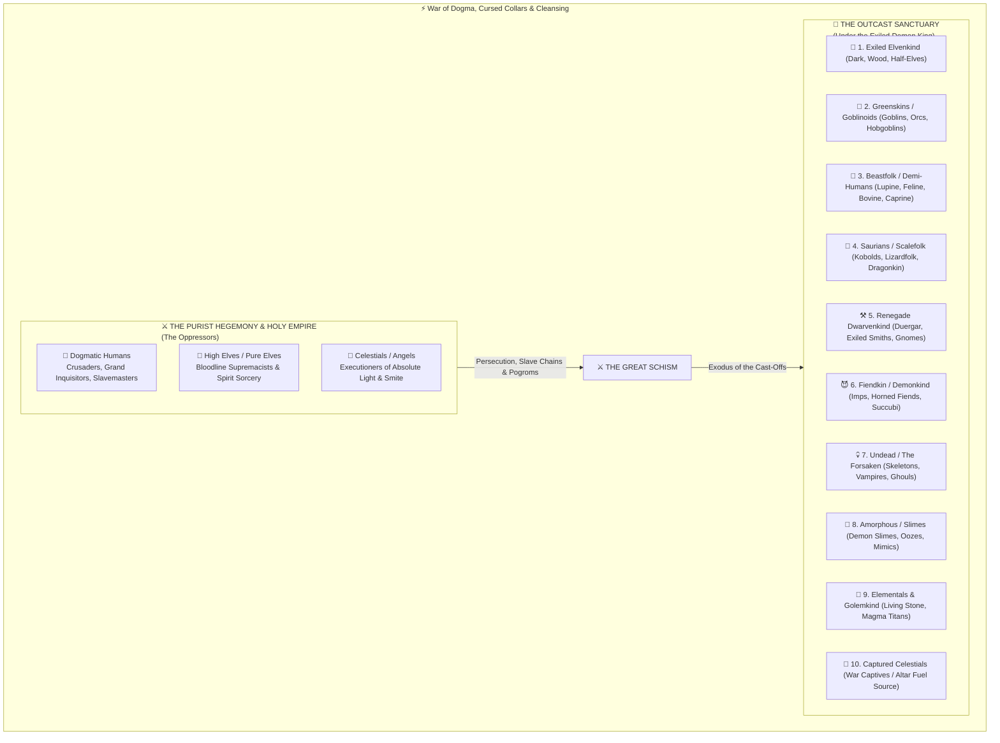
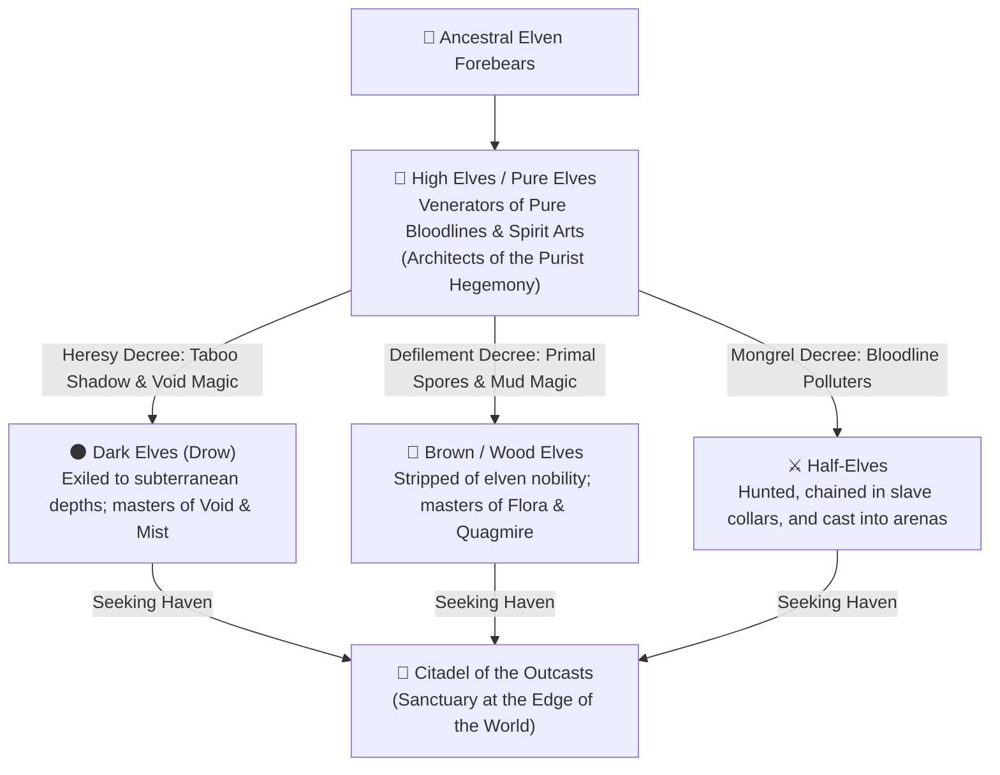
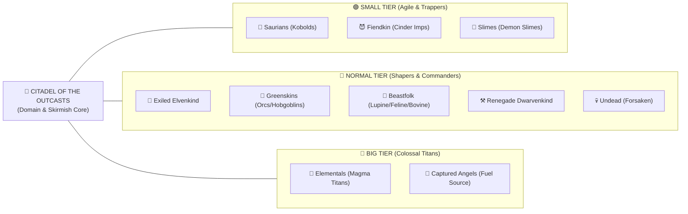
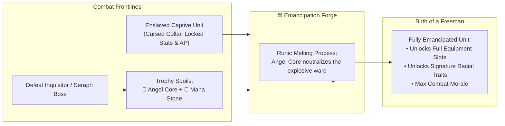
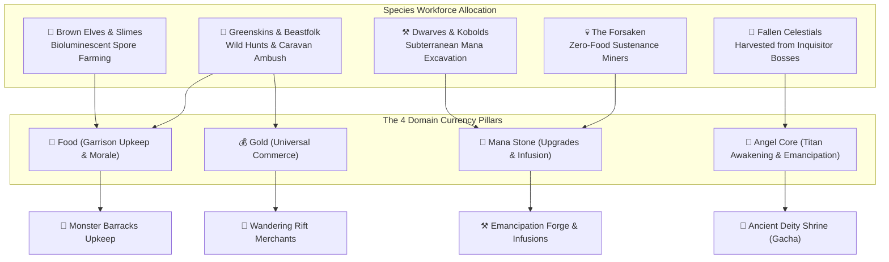

# 🌍 07. Broad Fantasy Races, Faction Schism & Tactical Taxonomy

Comprehensive encyclopedia of the **10 Broad Fantasy Species Pillars**, faction war doctrines, the ideological divide of the world (*The World Schism*), the tragedy of the cast-off elven bloodlines (*The Exiled Elven Schism*), and each race's tactical interactions on the 3D hex battlefield and Citadel domain economy.

---

## 🧭 1. The Great World Schism: The Purist Hegemony vs. The Outcast Sanctuary

The world of *Elemental Hex Tactics 3D* is radically divided by doctrines of absolute sanctity and systemic subjugation. Two civilizational poles clash in an eternal asymmetrical war:

### A. The Oppressors (*The Purist Hegemony*)
This coalition is rooted in an authoritarian theocracy holding that only beings of "unblemished lineage" and orthodox radiance possess the sovereign right to rule:
1. **👑 Dogmatic Humans (The Holy Empire):**
   - *Doctrine:* Ruled by fanatical priesthoods, ironclad Paladin orders, and inquisitorial tribunals (*The Holy Inquisition*).
   - *Mechanism of Subjugation:* The primary architects of continental slave trafficking. They bind demi-humans, goblins, and cast-off elves in **Cursed Slave Collars**, driving them into deep crystal mines and using them as disposable meat-shields on the vanguard.
2. **🧝 High Elves / Normal Elves (The Elitist Aristocracy):**
   - *Doctrine:* Zealous bloodline purists. They venerate pure elven genealogy and ethereal **Spirit / Divine Sorcery**, viewing themselves as the only true scions of elven heritage.
   - *Ethnic Viewpoint:* Any elven branch practicing dark magic or living in raw earthen flora is deemed an abomination. They provide the theological and mystical justification for the Empire's ethnic purges.
3. **🪽 Celestials / Angels (Arbiters of Absolute Light):**
   - *Doctrine:* Entities of dogmatic radiance summoned through imperial prayer cathedrals.
   - *Combat Role:* Unflinching arbiters. To an angel, physical divergence, primal instincts, and unorthodox magic are cosmic sins that must be purged with radiant fire (*Divine Smite*).

---

## 🧝 2. The Elven Bloodline Schism: The Cast-off Kins

The expulsion of elven kindred from the canopy of silver spires (*The Sylvan Highspire*) was not born of open civil war, but of an arrogant purity edict issued by the **High Elf Elders**.

### Exiled Elven Branches in the Sanctuary:
1. **🌑 Dark Elves (Drow / Umbral Elves):**
   - *Reason for Exile:* Rejected high elven orthodoxy to research taboo **Shadow, Curse, and Void magic** to understand cosmic equilibrium. Branded as heretics and driven underground.
   - *Sanctuary Role:* Master infiltrators, assassins, and mist snipers.
2. **🍄 Brown / Wood Elves (Wild Sylvan Elves):**
   - *Reason for Exile:* Rejected sterile, detached spirit rituals to commune with raw primal nature: damp humus, rotting ancient wood, subterranean spores, and carnivorous flora (*raw earth, flora, spores, and fungal ecology*). Deemed unclean barbarians and stripped of elven standing.
   - *Sanctuary Role:* Chief agriculturalists and mycelium engineers at the *Fungal Farms*.
3. **⚔️ Half-Elves (Cross-Bloods / The Stigmatized):**
   - *Reason for Exile:* Despised as "bloodline polluters" and mongrels. Born of pairings with common humans, they were hunted by Inquisitors, forced into cursed slave collars, or thrown into gladiator pits.
   - *Sanctuary Role:* Moral leaders of the resistance. Combining human resilience with elven mana affinity, they head emancipation efforts at the *Emancipation Forge*.

---

## 🏰 3. The 10 Broad Species Pillars of the Sanctuary

Under the banner of the **Exiled Demon King**, ten broad species pillars find refuge within the *Citadel of the Outcasts*. Each brings distinct morphology, size tiering (*Small/Normal/Big*), hex grid adaptations, and domain utility:

---

### 🧝 Pillar 1: Exiled Elvenkind (The Cast-off Kins)
* **Core Lineages:** Dark Elves, Brown/Wood Elves, Half-Elves.
* **Size Tiers:** `Normal` (Humanoid Shapers) & `Small` (Infiltrator Scouts).
* **Primary Elemental Affinities:** `Water` (Vapor/Mist), `Earth` (Flora/Spores), `Void/Shadow`.
* **Hex Grid Mechanics:**
  - **Vapor Shroud Mastery:** Gains high Evasion and targeting concealment while standing inside **Steam** clouds.
  - **Bog Trotter:** Brown Elves ignore movement penalties on **Mud (Quagmire)** tiles, traversing wetlands as if solid ground.
* **Signature Tactical Skills:**
  - `🌑 Shadow Flicker` *(Dark Elf - 1 Core)*: Teleports across 2 hexes into any tile shrouded in Steam or behind a pillar, delivering a critical venomous strike.
  - `🍄 Spore Bloom Trap` *(Wood Elf)*: Plants a mycelium trap on an empty hex. When an enemy steps on it, the tile turns to *Mud* and the target becomes `⛓️ Immobilized`.
* **Citadel Domain Role:**
  - **🌾 Fungal Farms:** Brown Elves optimize domain sustenance (*Food Upkeep*) through bioluminescent mushroom cultivation.
  - **⚒️ Emancipation Forge:** Half-Elves serve as rune technicians dismantling slave collar mechanisms.

---

### 🧌 Pillar 2: Greenskins & Goblinoids (The Scrap & Iron Legions)
* **Core Lineages:** Goblins (Scavengers & Trappers), Orcs (Shock Troopers), Hobgoblins (Warlords).
* **Size Tiers:** `Small` (Goblins) & `Normal` (Orcs / Hobgoblins).
* **Primary Elemental Affinities:** `Earth` (Craggy Stone) & `Neutral Physical`.
* **Hex Grid Mechanics:**
  - **Kinetic Impact Specialists:** Master of displacement mechanics (*Into the Breach*). Shove attacks trigger lethal collision bonuses.
  - **Rubble Scavenge:** Can shatter an adjacent **Stone Pillar** into protective barriers or projectile rubble.
* **Signature Tactical Skills:**
  - `💥 Brutal Shove` *(Orc Warrior)*: Pushes a target 1–2 hexes backward. Slamming an enemy into an elevated cliff, another unit, or a Stone Pillar triggers **`💥 WALL SLAM! -4`** (double the standard collision damage!).
  - `🦴 Scrap Trap` *(Goblin)*: Drops an iron caltrop trap on a hex, bleeding enemies and reducing their Move Range.
* **Citadel Domain Role:**
  - **🐺 Monster Barracks:** Enforces garrison discipline and leads convoy raids against imperial caravans to plunder Gold.

---

### 🐺 Pillar 3: Beastfolk & Demi-Humans (The Wild Kin)
* **Core Lineages:** Lupine (Wolves), Feline (Tigers/Panthers), Bovine (Minotaurs), Caprine (Satyrs/Sheep).
* **Size Tiers:** `Small` (Lupine/Feline Scouts) & `Normal` (Bovine Juggernauts).
* **Primary Elemental Affinities:** `Earth` (Wild Savanna) & `Water` (Primal Rivers).
* **Hex Grid Mechanics:**
  - **Apex Agility:** Small-tier Beastfolk possess high mobility (Move 4) and scale 1-level cliff elevations without AP penalties.
  - **Sure-Footed Paws:** Immune to tripping or displacement when holding high ground (*High Ground Advantage*).
* **Signature Tactical Skills:**
  - `🐺 Pack Pounce` *(Lupine Stalker)*: Leaps over 1 tile to maul an enemy, dealing critical damage if the target is flanked by an ally (*Flanking Bonus*).
  - `🐂 Battering Horns` *(Bovine Minotaur)*: Charges forward 2 hexes in a straight line, trampling through barriers and shoving all units in its wake.
* **Citadel Domain Role:**
  - **🌾 Primal Foraging:** Patrols the outer badlands to secure fresh meat for domain provisions (*Food*).

---

### 🦎 Pillar 4: Saurians & Scalefolk (Reptilians & Dragonkin)
* **Core Lineages:** Kobolds (Tunnelers), Lizardfolk (Amphibians), Dragonkin (Scaled Knights).
* **Size Tiers:** `Small` (Kobolds) & `Normal` (Lizardfolk / Dragonkin).
* **Primary Elemental Affinities:** `Water` (Deep Swamps) & `Fire` (Dragon Breath).
* **Hex Grid Mechanics:**
  - **Aquatic Mastery (Lizardfolk):** Swims freely through **Deep Water (Tier 2)** without triggering `⛓️ Immobilized` or `🦶 Crippled`. Receives `💧 Aqua Surge` (+1 Move).
  - **Thermal Scales (Dragonkin):** Completely ignores burn damage from **Scorched Earth (Tier 1)** and takes 50% reduced damage from **Magma (Tier 2)**.
* **Signature Tactical Skills:**
  - `🦎 Tidal Lunge` *(Lizardfolk)*: Pulls a land-bound enemy into an adjacent deep water or mud tile, forcibly subjecting them to mobility traps.
  - `🔥 Dragon Flare` *(Dragonkin)*: Breathes an arc of flame across 3 hexes, converting dry terrain to Scorched Earth and boiling water into Steam clouds.
* **Citadel Domain Role:**
  - **⛏️ Mana Mine:** Kobolds are the fastest tunnelers in the realm, doubling passive Mana Stone extraction rates.

---

### ⚒️ Pillar 5: Renegade Dwarvenkind & Underfolk (Subterranean Outcasts)
* **Core Lineages:** Duergar (Deep Dwarves), Exiled Runesmiths, Svirfneblin (Deep Gnomes).
* **Size Tiers:** `Normal` (Dwarf Bastions) & `Small` (Gnome Sappers).
* **Primary Elemental Affinities:** `Earth` (Primal Granite & Ancient Alloys).
* **Hex Grid Mechanics:**
  - **Geomantic Masonry:** Lowers the action cost to raise **Stone Pillars** on neutral terrain.
  - **Heavy Anchor:** Sturdy center of gravity reduces all incoming enemy shove distances by 1 hex.
* **Signature Tactical Skills:**
  - `⛰️ Bastion Eruption`: Raises 2 adjacent **Stone Pillars** simultaneously, choking enemy lanes and creating wall-slam rebound surfaces.
  - `💣 Seismic Shatter`: Detonates a friendly Stone Pillar, peppering all 6 surrounding hexes with razor-sharp granite shrapnel.
* **Citadel Domain Role:**
  - **⚒️ Emancipation Forge:** Leads weaponsmithing, elemental infusions, and crafting hazard gear (*Lava Walkers, Frost Soles*).

---

### 😈 Pillar 6: Fiendkin & Demonkind (Abyssal Bloodlines)
* **Core Lineages:** Cinder Imps, Horned Fiends, Succubi / Incubi.
* **Size Tiers:** `Small` (Imps), `Normal` (Horned Demons), `Big` (Abyssal Fiends).
* **Primary Elemental Affinities:** `Fire` (Hellfire & Nether Flames).
* **Hex Grid Mechanics:**
  - **Innate Lava Walkers:** Traverses **Molten Magma** without suffering burn damage.
  - **Flame Surge Empowerment:** Gains an enhanced **+3 Attack Damage** buff (exceeding standard +2) when fighting atop Magma.
* **Signature Tactical Skills:**
  - `🔥 Hellfire Siphon`: Consumes magma energy from the current tile to restore HP and harvest +1 Elemental Core (`★`).
  - `😈 Abyssal Beckon` *(Succubus)*: Compels an enemy to walk 1 hex toward a chosen tile (deadly for pulling foes into magma pools or off cliffs).
* **Citadel Domain Role:**
  - **👑 Demon Lord Citadel:** Sworn honor guards protecting the throne room and coordinating war council deployments.

---

### 💀 Pillar 7: Undead & The Forsaken (The Deathless)
* **Core Lineages:** Skeletons, Crypt Ghouls, Exiled Vampires, Necrotic Liches.
* **Size Tiers:** `Normal` (Humanoid Undead) & `Small` (Crawling Ghouls).
* **Primary Elemental Affinities:** `Earth` (Ancient Tombs) & `Void/Necrotic`.
* **Hex Grid Mechanics:**
  - **Zero Metabolism (Domain Perk):** Requires zero rations at the barracks (**Food Upkeep = 0**).
  - **Hazard Apathy:** Immune to poison, steam choking, and bleeding. Takes 50% increased damage from angelic radiant attacks.
* **Signature Tactical Skills:**
  - `🦴 Bone Palisade`: Upon death, skeletal remains solidify into an impassable bone barricade that functions identically to a **Stone Pillar** for collisions.
  - `🩸 Blood Mire`: Corrupts water puddles into acidic blood pools that damage the living while mending undead allies.
* **Citadel Domain Role:**
  - **🐺 Night Patrol & Unsleeping Miners:** Works endlessly in deep mine tunnels without fatigue, sleep, or provisions.

---

### 🧪 Pillar 8: Amorphous & Slimes (Liquid & Gelatinous Organisms)
* **Core Lineages:** Demon Slimes, Acid Oozes, Gelatinous Cubes, Mimics.
* **Size Tiers:** `Small` (Slime Minions) & `Normal` (Acid Oozes).
* **Primary Elemental Affinities:** `Water` (Caustic Acid) & `Earth` (Viscous Mud).
* **Hex Grid Mechanics:**
  - **Wall-Slam Shock Absorber:** Gelatinous mass makes slimes **completely immune to `💥 WALL SLAM!` bonus damage** (they bounce off harmlessly).
  - **Amorphous Translocation:** Can move through hexes occupied by allies or enemies without collision stopping (*Pass-Through Movement*).
* **Signature Tactical Skills:**
  - `💧 Viscous Quagmire`: Expels viscous jelly onto water, immediately transforming it into **Mud** to entrap surrounding foes.
  - `🧪 Acidic Dissolve`: Melts enemy armor, stripping physical defenses and corroding equipment durability.
* **Citadel Domain Role:**
  - **🌾 Fungal Farms:** Decomposes waste into organic mana mash, accelerating spore growth.

---

### 🗿 Pillar 9: Elementals & Golemkind (Primal Forces & Living Stone)
* **Core Lineages:** Living Granite, Magma Titans, Arcane Colossi, Runed Monoliths.
* **Size Tiers:** `Big` (Colossal Titans) & `Normal` (Golems).
* **Primary Elemental Affinities:** `Fire` (Magma), `Earth` (Living Stone), `Water` (Tidal Spirits).
* **Hex Grid Mechanics:**
  - **Colossal Heavyweight:** Massive size makes Titans **completely immune to displacement (Unshovable)**.
  - **Elemental Resonance:** Standing on tiles of their native element passively regenerates Titan HP each round.
* **Signature Tactical Skills:**
  - `🌋 Magma Cataclysm` *(Magma Titan - 1 Core)*: Blasts the target tile and all 6 surrounding hexes (7 hexes total) for **8 Massive Damage**, igniting neutral earth into molten Magma!
  - `💥 Seismic Stomp`: Slams the earth, releasing a radial shockwave that shoves all surrounding adjacent units 1 hex away.
* **Citadel Domain Role:**
  - **🏰 Living Bulwarks:** Anchors the gates of the Citadel during imperial holy incursions.

---

### 🪽 Pillar 10: Celestials / Angels (The Fuel of the Sanctuary)
* **Status in the Sanctuary:** **THE IRONY OF THE OPPRESSOR AS FUEL.**
* **Lore Context:** Unlike the other 9 kindreds who unite through brotherhood in exile, angels exist in the Citadel strictly as **War Captives**. Their radiant wings are shattered by the Demon King's bindings, and their celestial ribcages are opened to extract **Angel Cores (`🪽 Angel Core`)**.
* **Size Tiers:** `Normal` (Inquisitorial Cherubs) & `Big` (Bound Seraphim).
* **Primary Elemental Affinities:** `Divine Light` (Holy Radiance) & `Twilight Ray` (Corrupted Light).
* **Citadel Domain Utility:**
  1. **🔮 Ancient Deity Shrine (Titan Awakening Fuel):**
     - Harvested `🪽 Angel Cores` are cast into the purple braziers as sacred tribute to awaken ancient Titans (*Gacha Summoning*).
  2. **⚒️ Emancipation Forge (Collateral Disenchantment):**
     - The explosive runes on imperial slave collars can only be neutralized by bathing them in raw Angel Core radiation at the anvil, freeing slaves safely without detonating their collars!
  3. **The Fallen Renegades (The Apostate Angels):**
     - Rare angels who witness the atrocities of the high church and shatter their own halos, wielding *Twilight Smite* to turn imperial blessings into curses.

---

## 📊 4. Tactical Comparison Matrix & 3D Hex Grid Mechanics

Summary of all 10 broad species pillars on the 3D tactical grid:

| Species Pillar | Size Tier | Native Affinity | Dominant Hex Interaction | Kinetic Push & Collision Behavior | Citadel Domain Role |
| :--- | :---: | :---: | :--- | :--- | :--- |
| **🧝 Exiled Elves** | `Normal` / `Small` | Water / Earth / Void | Shrouded in **Steam**; ignores **Mud** slow. | Standard; leverages pillar angles for traps. | **Fungal Farms** (Food) & Disenchanters. |
| **🧌 Greenskins** | `Normal` / `Small` | Earth / Physical | Shatters **Stone Pillars** into rubble. | Specialized **Double Wall-Slam Damage** (`💥 -4`). | **Monster Barracks** & Caravan Raiders. |
| **🐺 Beastfolk** | `Normal` / `Small` | Earth / Water | Scales vertical cliffs; base Move Range 4. | Leaps over barriers; directional shove horns. | Badland Hunting (Meat & Food). |
| **🦎 Saurians** | `Normal` / `Small` | Water / Fire | Swims through **Deep Water**; thermal scales. | Drags foes into water/mud traps. | **Mana Mine** (Rapid Tunnel Excavators). |
| **⚒️ Renegades** | `Normal` / `Small` | Pure Earth | Raises double **Stone Pillars**; seismic quakes. | Shove resistance (reduces enemy push by 1 hex). | **Emancipation Forge** (Infusion Smiths). |
| **😈 Fiendkin** | `Normal` / `Big` | Pure Fire | Traverses **Magma**; enhanced Flame Surge (+3). | Beckons enemies toward magma/cliffs. | **Demon Citadel** (Throne Honor Guard). |
| **💀 Undead** | `Normal` / `Small` | Earth / Void | Fallen bodies solidify into bone barriers. | Rigid frames; immune to poison/steam blind. | Unsleeping Miners (**Upkeep Food = 0**). |
| **🧪 Slimes** | `Small` / `Normal` | Water / Mud | Inundates water into **Mud**; phases through units. | **Immune to Wall-Slam Damage** (Elastic bounce). | Organic Waste Composting at Farms. |
| **🗿 Elementals** | `Big` (Titan) | Elemental Triad | Native tile regeneration; *Magma Cataclysm*. | **Completely Unshovable (Heavyweight)**. | Living Bastions at Citadel Gates. |
| **🪽 Celestials** | `Normal` / `Big` | Divine / Twilight | Scorches neutral tiles to radiant dust. | Gusts enemies backward with light wings. | **Angel Core Fuel** for Shrine & Forge. |

---

## ⛓️ 5. Cursed Slave Collars & The Emancipation Loop

A core narrative pillar of *Elemental Hex Tactics 3D* is freeing the oppressed from the Holy Empire's dominion:

### Mechanics of the Cursed Slave Collar:
1. **Imperial Enslavement:**
   - Captured demi-humans, goblins, and half-elves are fitted with explosive rune collars.
   - Combat debuffs: Locks 1 equipment slot, caps maximum Move Range, and inflicts self-damage if targeting human commanders.
2. **Emancipation at the Forge:**
   - Rescued captives are brought to the **Emancipation Forge**.
   - Breaking a collar requires **1x Angel Core** and **Mana Stones**.
   - Once freed, the unit unlocks its hidden racial traits, full equipment loadouts, and can be assigned as active squad leaders or domain workforce masters!

---

## 🏛️ 6. Ten-Race Synergy with the Citadel Domain Economy

The 4-currency macro economy (*The Golden Quadrant: Gold, Food, Mana Stone, Angel Core*) is sustained by the complementary talents of the 10 species pillars:

---

## 🔗 7. Cross-Wiki Directory

This document establishes the narrative and racial foundation across the tactical engine:
* [**01. Overview & Tactical Controls**](01-Overview-and-Controls) — Camera orbit controls, turn economy, and action bar.
* [**02. Elemental Reaction Matrix**](02-Elemental-Reaction-Matrix) — Fire, Water, and Earth reactions, Steam clouds, and Quagmires.
* [**03. Kinetic Combat & Hazards**](03-Kinetic-Combat-and-Hazards) — Wall-Slam physics, deep water traps, and mobility denial.
* [**04. Units, Archetypes & Attunement**](04-Units-and-Attunement) — Skirmish units, 3-tier size taxonomy, and passive tile attunement.
* [**05. Technical Architecture**](05-Technical-Architecture) — Unity 6 URP architecture, procedural 3D hex meshes, and zero-asset design.
* [**06. Citadel Hub & Domain Economy**](06-Citadel-Hub-and-Domain-Economy) — 2D Citadel Hub, 4 currencies, and equipment shops.

---

*Authored by Elang Esa Yudhistira (Neal Sage / NealversePrime) — Solo Game Designer & Programmer.*
