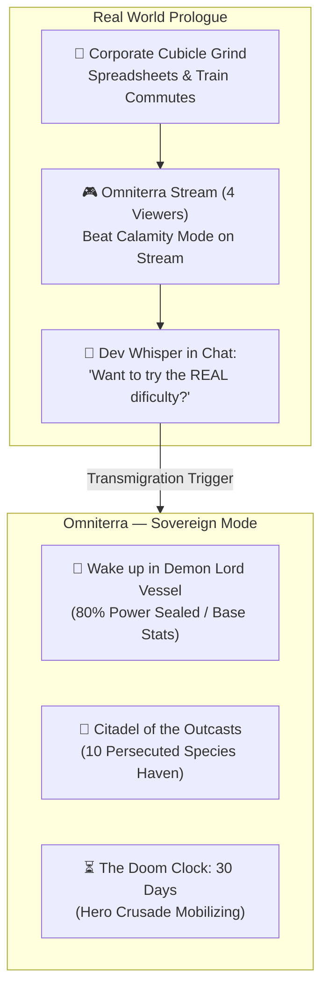
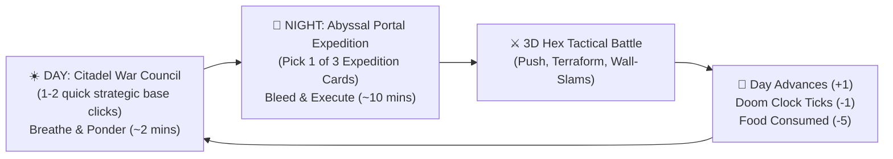
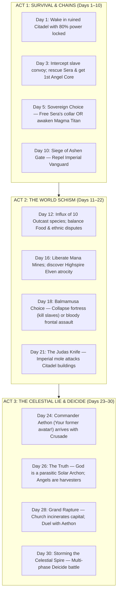

# ⏳ 08. Campaign Loop, The 2-Cycle Day & Manhwa Narrative Design

> **Document Status:** `LOCKED / CORE ARCHITECTURE`  
> **System Lead:** Elang Esa Yudhistira (Neal Sage / NealversePrime)  
> **Design Pillars:** Asymmetric 2-Cycle Day, Trilemma Portal Deck, Isekai Narrative Inversion, Zero-Bloat Heuristics.

---

## 🧭 1. Executive Concept & The Transmigration Premise

**High Concept:** An exhausted 20-something corporate salaryman/woman—the *only* player in the world who ever conquered the brutally difficult tactical strategy game **"Omniterra"** on Calamity Mode—accepts an ominous developer prompt and gets transmigrated directly into the game world. But instead of the righteous Hero they played for 2,000 hours, they wake up inside the vessel of the **Exiled Demon Lord** at the crumbling *Citadel of the Outcasts at the Edge of the World*.

The catch? The **Hero's Holy Crusade** arrives in **25 to 30 Days**. And the Hero marching toward them is **Commander Aethon**—their own former player avatar, utilizing the player's own ruthless, optimal battle tactics.



### Player Character Setup (Prologue Flow)
1. **Name & Gender Selection:** The player inputs their real name (e.g. *"Neal"* / *"Sage"*) and chooses Pronouns / Gender (`He` / `She`). 
2. **The Diagetic Inversion:** In the real world, the player was a nobody. In Omniterra, all outcast NPCs refer to them reverently as *"My Lord"* or *"Sovereign"*, but the internal **System UI** (which only the MC can see) displays their real human name and gamer tags.
3. **The Core Guilt:** The player spent 2,000 hours treating monsters as cannon-fodder sprites. Waking up on the other side, they discover that **Pip the Kobold** (whom they used as sacrificial bait in-game) has burn scars on his hands and brings them warm mushroom broth. **Sera the Half-Elf** (a forgettable item vendor in the Holy Capital) has explosive runes branded into her neck by a **Cursed Slave Collar**.

---

## 🛑 2. Anti-Bloat Directive: The Asymmetric 2-Cycle Day

> [!CAUTION]
> **Avoid the "Monastery Trap" at all costs!**  
> Large studio games like *Persona 5* or *Fire Emblem: Three Houses* feature 4-phase days (Morning, Midday, Evening, Night) with dozens of chore minigames, walking around 3D spaces, fishing, and tea parties. For a solo indie developer, a 4-cycle calendar across 30 days equals **120 context switches**, ballooning UI complexity, causing severe player chore fatigue, and distracting from our core selling point: **punchy 3D hex combat!**

### The Solution: The "Breathe & Bleed" 2-Cycle Rhythm
Inspired by *The Last Spell*, *Darkest Dungeon*, and *Into the Breach*, each in-game calendar day consists of **exactly 2 high-impact phases**:



### Phase 1: ☀️ Daytime — Citadel War Council (Safe Harbor / Ponder)
* **Duration:** ~1 to 2 minutes. Zero 3D walking around. 100% interactive 2D canvas UI (our realized `TownHubManager`).
* **Action Economy:** The player has **1 or 2 Base Actions** per morning:
  * **⚒️ Emancipation Forge:** Spend an `🪽 Angel Core` to shatter a rescued captive's slave collar, or forge an elemental weapon infusion.
  * **🌾 Fungal Farms / ⛏️ Mana Mine:** Collect daily yields or reassign outcast species (e.g. Wood Elves to farming, Kobolds to mining).
  * **🐺 Monster Barracks:** Review squad health, manage unit equipment slots (Boots, Goggles, Relics).
  * **👑 Throne Room / Dialog:** Converse with outcast leaders (Gorath, Myriel, Sera) to resolve disputes and raise **Trust Level**.

### Phase 2: 🌙 Nightfall — Abyssal Rift Expedition (Tension & Execution)
* **Duration:** ~8 to 12 minutes.
* **The Trigger:** The player clicks the **Abyssal Rift Portal** in the Citadel hub.
* **The Interface:** Instead of an intimidating overworld map or complex procedural node tree (*Slay the Spire* / *FTL*), the portal opens a sleek modal presenting **The Trilemma of Opportunity Cost: 3 Randomized Expedition Cards**.
* The player selects **one mission**, deploys their 2v2 or 4v4 skirmish squad, and enters the 3D hex battlefield.

---

## 🃏 3. The 3-Choice Portal System (The Strategic Trilemma)

Game design lives and dies on **meaningful mutual exclusivity**. By presenting exactly 3 mission cards drawn each night, the player is forced to confront their most urgent crisis while sacrificing two others (Hick's Law).

```
       [ CALENDAR HUD: DAY 14  |  CRUSADE ARRIVAL IN: 8 DAYS  |  FOOD: 12 ]
                                    |
       +----------------------------+----------------------------+
       |                            |                            |
       v                            v                            v
[ PORTAL CARD 1 ]            [ PORTAL CARD 2 ]            [ PORTAL CARD 3 ]
⛓️ SLAVE CONVOY AMBUSH        ⛏️ CRYSTAL VEIN RAID         ⏳ VANGUARD SABOTAGE
Type: Rescue / Recruitment   Type: Resource Scavenge      Type: Doom Clock Delay
Threat: Tier 2 (Moderate)    Threat: Tier 1 (Low)         Threat: Tier 3 (High)
Biome: Volcanic Crag         Biome: Flooded Wetland       Biome: Imperial Outpost
Reward: Free Dark Elf Mage   Reward: +90 Mana, +40 Food   Reward: +2 DAYS TO CRUSADE
```

### The 4 Core Expedition Archetypes

| Card Archetype | Strategic Function & Player Motivation | In-Battle Objective & Tactical Twist |
| :--- | :--- | :--- |
| **⛓️ 1. Slave Convoy Ambush**<br/>*(Rescue / Workforce)* | **Expands Roster & Domain:** Frees collared outcasts. Rescued units can be equipped for battle or assigned to Citadel facilities to boost daily resource faucets. | Break the prisoner cage hex before Turn 5, or eliminate Inquisitorial slave wardens before they trigger explosive collar runes. |
| **⛏️ 2. Supply / Crystal Raid**<br/>*(Resource Scavenge)* | **Fights Famine & Upkeep:** Massive haul of **Food** (prevents monster starvation at barracks) and **Mana Stones** (fuels weapon infusions). | Capture and hold 2 Mana Ley-Lines for 2 rounds, or loot supply crates before Imperial guards burn them. |
| **⏳ 3. Vanguard Sabotage**<br/>*(Doom Clock Defense)* | **Buys Time Against the Hero:** **Adds +1 or +2 Days to the Crusade Countdown!** Essential when your squad is under-leveled or unequipped. | Assassinate the Imperial Scout Captain or detonate 2 siege engines under heavy crossfire. |
| **🗿 4. Wild Titan / Monster Hunt**<br/>*(Rare 35% Draw)* | **High-Risk Power Spike:** Confront a rogue, territorial beast. Subduing it unlocks a Colossal Titan (e.g. *Magma Behemoth*) or beast mount. | Reduce Titan HP below 25% without killing it, or survive 5 rounds against enraged AoE *Seismic Stomps*. |

### Anti-Starvation & Doom-Clock Safety Guardrails (Deck Drafting Rules)
To prevent unfair RNG death-spirals, the card generator uses a **Weighted Grab-Bag** with deterministic fail-safes:
1. **The Doom-Clock Valve:** If `DaysRemaining <= 3`, **Archetype 3 (Sabotage)** is guaranteed to occupy at least 1 card slot.
2. **The Famine Valve:** If Citadel `Food < 15`, **Archetype 2 (Scavenge)** is guaranteed in Slot 1.
3. **The Elite Temptation:** Slot 3 has a 35% roll for **Archetype 4 (Wild Titan)**, forcing the player to weigh immense greed against urgent survival.

---

## 📜 4. Three-Act Campaign Progression & Narrative Beats



### The 3 Campaign Endings

```
                           [ FINAL DEICIDE BATTLE WON ]
                                        │
           ┌────────────────────────────┼────────────────────────────┐
           ▼                            ▼                            ▼
   [ 👑 ENDING A: ASCEND ]     [ 🌅 ENDING B: SHATTER ]     [ 🚪 ENDING C: RETURN ]
   Absorb the Archon's core.   Destroy the Core & Dome.    Spend core energy to return
   Become the new God.         Free the world into chaos.  to your cubicle apartment.
   Eternal order, golden cage. Wild weather & living earth. The game is uninstalled.
   Pip brings soup to a god.   Mortals build their future.  You miss them every day.
   (The Tragic Perfection)     (The Canon True Ending)      (The Bittersweet Exit)
```

---

## 💻 5. Technical Architecture & Minimal Data Models

### Singletons & Managers (Zero Overhead)
1. **`CalendarManager.cs`:**
   ```csharp
   public class CalendarManager : MonoBehaviour
   {
       public static CalendarManager Instance { get; private set; }
       
       public int CurrentDay = 1;
       public int CrusadeArrivalDay = 25; // Sabotage missions add +1 or +2!
       public int DailyFoodUpkeep = 5;
       
       public int DaysUntilCrusade => Mathf.Max(0, CrusadeArrivalDay - CurrentDay);
       
       public void AdvanceDay(int daysDelayed = 0)
       {
           CrusadeArrivalDay += daysDelayed;
           CurrentDay++;
           ResourceManager.Instance.ConsumeFood(DailyFoodUpkeep);
           
           if (DaysUntilCrusade <= 0)
               TriggerCrusadeInvasion();
       }
   }
   ```
2. **`MissionDefinitionSO.cs` (ScriptableObject):**
   ```csharp
   [CreateAssetMenu(fileName = "Mission_", menuName = "Tactics/Mission Definition")]
   public class MissionDefinitionSO : ScriptableObject
   {
       public string MissionName;
       public MissionArchetype Archetype; // Rescue, Scavenge, Sabotage, Titan
       public int ThreatLevel; // 1 to 3 stars
       public string TargetBiome; // Volcanic, MudSwamp, StoneRuins
       public int FoodReward;
       public int ManaReward;
       public int CrusadeDelayDays; // e.g. +2 for Sabotage
       public GameObject EnemySquadPrefab;
   }
   ```

3. **UI Integration in [`TownHubManager.cs`](file:///d:/Unity/ElementalHexTactics3D/Assets/Scripts/UI/Hub/TownHubManager.cs):**
   * Clicking `Node_Portal` no longer instantly triggers the combat scene.
   * Instead, it opens `Modal_ExpeditionPortal`, which instantiates 3 `ExpeditionCardUI` prefabs populated by `ExpeditionCardGenerator.GenerateDailyTrilemma()`.
   * Clicking a card passes the selected `MissionDefinitionSO` into `BattleContext` and initiates the 3D camera transition into the battle grid!

---

## 🛠️ 6. Solo Dev Scope Kill-Lines (MoSCoW Rules)

| Priority Tier | Features Included | Dev Rationale |
| :--- | :--- | :--- |
| **P0 (Must-Have for MVP)** | • 2-Cycle Day/Night calendar state machine.<br/>• 3-Card Portal selection UI popup.<br/>• Food upkeep consumption & basic Crusade countdown.<br/>• 1 Rescue mission type & 1 Sabotage mission type. | Without this, there is no campaign loop or tension. |
| **P1 (Core Vertical Slice)** | • All 4 Mission Archetypes functioning.<br/>• Angel Core collar removal loop at the Forge.<br/>• Trust gauge influencing unit dialog.<br/>• Timeline divergence alerts on HUD. | Delivers the full fantasy of the manhwa narrative. |
| **P2 (Polish & Juice)** | • Animated card flip on portal modal open.<br/>• Weather/ambient lighting shift between Day & Night.<br/>• Campfire banter dialogs between battles. | Adds emotional weight, but cut if behind schedule. |
| **WON'T HAVE (Cut Immediately)** | ❌ **No 3D character walking in the citadel hub.**<br/>❌ **No fishing, farming, or cooking minigames (monastery trap!).**<br/>❌ **No complex branching node maps (Slay the Spire tree).**<br/>❌ **No 100-enemy horde survival (stick to 2v2 to 4v4 chess tactical skirmishes).** | These features bloat indie development and kill projects. |

---

*Authored by Elang Esa Yudhistira (Neal Sage / NealversePrime) — Solo Game Designer & Programmer.*  
*Dev Note: Keep it punchy, keep it tactical, and never let the player forget Pip's mushroom soup!*

