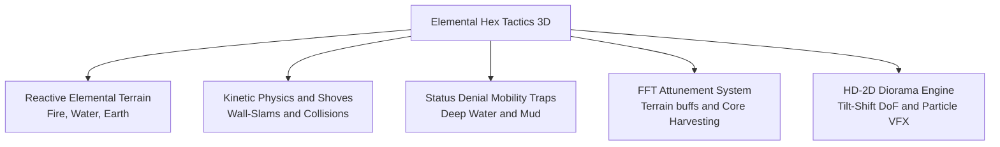

# 📖 Elemental Hex Tactics 3D — Official Wiki

Welcome to the official developer and player wiki for **Elemental Hex Tactics 3D**!

This game is a **2.5D HD-2D Tactical Turn-Based Strategy RPG** built from scratch in **Unity 6 (URP)**. It bridges the tactical emergent depth of *Divinity: Original Sin* with the spatial puzzle physics of *Into the Breach*, presented in a modern *Triangle Strategy* / *Octopath Traveler* diorama aesthetic.

---

## 📸 In-Game Screenshots

| 💥 Magma Cataclysm & Particle VFX | 🛡️ Tactical Action & Combat Grid |
| :---: | :---: |
|  |  |

---

## 📑 Wiki Directory

| Page | Description |
| :--- | :--- |
| [**01. Overview & Tactical Controls**](01-Overview-and-Controls) | Game concept, 3D tactical camera controls, turn economy, and action bar interface. |
| [**02. Elemental Reaction Matrix**](02-Elemental-Reaction-Matrix) | Full interaction matrix for **Fire, Water, and Earth**, 3-Hex Steam Eruptions, and Quagmires. |
| [**03. Kinetic Combat & Hazards**](03-Kinetic-Combat-and-Hazards) | Shove physics, Wall-Slam collisions, environmental hazards, and mobility debuffs. |
| [**04. Units & Attunement**](04-Units-and-Attunement) | Unit stats, archetypes (Commander vs Titan vs Minion), abilities, and FFT Attunement buffs. |
| [**05. Technical Architecture**](05-Technical-Architecture) | Unity 6 URP architecture, procedural 3D hex meshes, procedural particle VFX engine, and zero-asset design. |
| [**06. Citadel Hub & Economy**](06-Citadel-Hub-and-Domain-Economy) | Interactive 2D Town Hub, 4-currency ecosystem, merchant gear catalog, and unrealized systems roadmap. |

---

## 💡 Quick Summary of Core Mechanics

### 1. The Triad Elements: Fire, Water, Earth
- **Fire (`🔥`)**: Charred earth → Scorched Earth (Tier 1) → Molten Magma (Tier 2).
- **Water (`💧`)**: Inundation → Shallow Water (Tier 1) → Deep Water (Tier 2).
- **Earth (`⛰️`)**: Solid ground → Stone Pillars (Obstacles) / Quagmire Mud Traps.
- **Steam (`💨`)**: Fire + Water or Magma + Water creates tactical smokescreens. Quenching Magma triggers a **3-Hex random adjacent Steam Eruption**!

### 2. Kinetic Shoves & Wall Slams
- Attacking with `💨 Push` or `💨 Tail Shove` displaces the enemy 1 hex backward.
- If the destination hex is blocked by a **cliff elevation**, another **unit**, or a **Stone Pillar**, the unit slams into it for **`💥 WALL SLAM! -2`** bonus damage with screen shake!

### 3. Mobility Traps (Turn Denial)
- Stepping or being pushed into **Deep Water (Tier 2)** or **Mud** triggers:
  - **Turn 1 — `⛓️ Immobilized`:** Unit movement distance drops to 0.
  - **Turn 2 — `🦶 Crippled`:** Unit can only move a maximum of 1 tile.
- Aquatic units and Colossal Titans are immune!

### 4. FFT Geomancer Attunement
- Units gain passive power based on the tile they stand on:
  - **🔥 Flame Surge**: +2 Attack Damage on fire terrain.
  - **💧 Aqua Surge**: +1 Move Range in water.
  - **💨 Vapor Shroud**: Evasion/cover inside steam clouds.

---

*Authored by Elang Esa Yudhistira (Neal Sage / NealversePrime) — Solo Game Designer & Programmer.*

