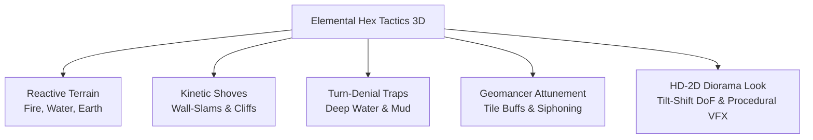

# ⚔️ Elemental Hex Tactics 3D — Dev Wiki & Design Bible

Welcome to the dev wiki for **Elemental Hex Tactics 3D**! 

I'm building this game solo in **Unity 6 (URP)**. The pitch is pretty simple: what if you took the chaotic elemental reactions from *Divinity: Original Sin*, mashed it together with the spatial push-physics of *Into the Breach*, and wrapped the whole thing in a warm HD-2D diorama look like *Triangle Strategy* or *Octopath*?

---

## 📸 In-Game Screenshots

| Magma Cataclysm & Particle VFX | Tactical Combat & Hex Grid |
| :---: | :---: |
|  |  |

---

## 📑 Wiki Pages & Documentation

| Chapter | What's Inside |
| :--- | :--- |
| [**01. Overview & Tactical Controls**](01-Overview-and-Controls) | Core design pillars, 60° camera orbit controls, turn loop, action economy. |
| [**02. Elemental Reaction Matrix**](02-Elemental-Reaction-Matrix) | Fire, Water, and Earth reactions, 3-Hex Steam Eruptions, and Quagmire rules. |
| [**03. Kinetic Combat & Hazards**](03-Kinetic-Combat-and-Hazards) | Shove vectors, Wall-Slam collision math, deep water traps, mobility debuffs. |
| [**04. Units & Attunement**](04-Units-and-Attunement) | 3-tier unit taxonomy (Small/Normal/Big), stats, and FFT-style tile attunements. |
| [**05. Technical Architecture**](05-Technical-Architecture) | Unity 6 URP setup, procedural 3D hex meshes, procedural particle textures (zero asset packs!). |
| [**06. Citadel Hub & Economy**](06-Citadel-Hub-and-Domain-Economy) | 2D interactive Citadel canvas, 4-currency system (Gold, Food, Mana, Angel Cores), forge specs. |
| [**07. Races & Factions**](07-Broad-Races-and-Factions) | The 10 Outcast Species, Elven Bloodline Schism, Purist Hegemony vs Outcast Sanctuary. |
| [**08. Campaign Loop & Mechanics**](08-Campaign-Loop-and-Narrative-Design) | 2-cycle day loop, 3-card Portal trilemma, anti-bloat rules. |
| [**09. Story: The Last Player**](09-Campaign-Story-The-Last-Player) | Complete interactive campaign script in 2nd-person ('You'), dialogues, and 3 endings. |

---

## Quick Mechanics Summary (The Elevator Pitch)

### 1. The Elemental Triad (Fire, Water, Earth)
* **Fire (`🔥`):** Charred earth $\rightarrow$ Scorched Earth (Tier 1) $\rightarrow$ Molten Magma (Tier 2).
* **Water (`💧`):** Wet tiles $\rightarrow$ Shallow Water (Tier 1) $\rightarrow$ Deep Water (Tier 2).
* **Earth (`⛰️`):** Neutral ground $\rightarrow$ Stone Pillars (solid cover/collision obstacles) / Mud Quagmires.
* **Steam (`💨`):** Fire + Water makes steam clouds. Quenching Molten Magma triggers a **3-Hex adjacent Steam Eruption** that blinds everything caught inside.

### 2. Kinetic Shoves & Wall Slams
* Basic attacks like `Push` or `Tail Shove` knock units back 1 hex.
* If their destination hex is blocked by high ground, another unit, or a raised Stone Pillar, they take **`💥 WALL SLAM! -2`** bonus collision damage with directional screen shake.

### 3. Status Denial Mobility Traps
* Stepping (or getting shoved) into **Deep Water** or **Mud** hits units with progressive turn-denial instead of boring tick damage:
  * **Turn 1 — `⛓️ Immobilized`:** Move range drops to 0 (completely stuck).
  * **Turn 2 — `🦶 Crippled`:** Can only crawl 1 hex to escape.
* Aquatic units and Colossal Titans ignore this completely.

### 4. Geomancer Attunement & Land Siphoning
* Standing on elemental ground grants passive buffs:
  * **Flame Surge:** +2 Attack on Scorched/Magma tiles.
  * **Aqua Surge:** +1 Move Range in Water.
  * **Vapor Shroud:** Evasion/cover inside Steam.
* You can also **Siphon** active tiles to turn them back to barren ground and harvest **Elemental Cores** to fuel massive titan abilities like **Magma Cataclysm**.

---

*Dev Note: This wiki is my living design notebook. Stuff changes as I playtest and tweak balance, but the core pillars here are locked in.*
